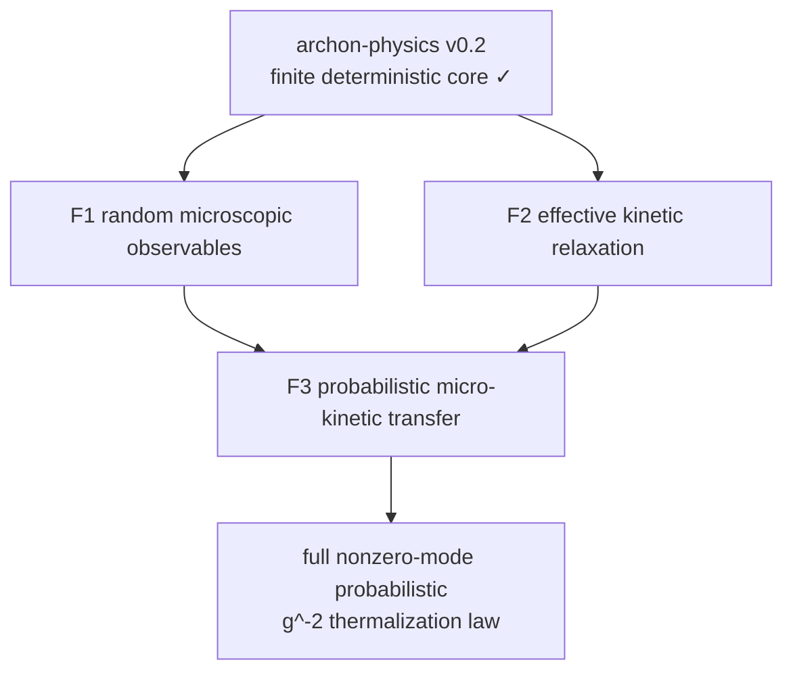

# 完整热化目标的证明 DAG

本轮采用 **3 个新 family**。现有 `archon-physics v0.2` 是已认证的冻结底座，不重新拆分；若把底座也计入图中，则是“1 个 base + 3 个新 family”，另有一个不承载实现的 synthetic release root。



F1 与 F2 可以并行；F3 是唯一汇合点。Anderson 局域化、论文证据、`n=3/4/5` 和数值参数都不另立 family，以免制造不必要的依赖层。

## 完整目标

“随机微观晶格必然热化”不能写成对每个质量 realization 和每个初态成立。正式目标固定以下数据：

- 一个支撑在 `[m₋,m₊] ⊂ (0,∞)` 上的 iid 质量分布；
- 一个独立 Haar-uniform 初相位序列和一个指定的非平衡初始能谱族；
- 一个具体的 coercive cubic-leading 势；
- 全部 `N-1` 个非零谐波模，排除平移零模；
- `0 ≤ μ < 1`、`0 < δ < 2`，以及晚时窗模态能量的归一化 `ℓ¹` 距离。

第一版发布目标是高概率双边律：存在 `0 < c ≤ C` 和证明产生的 `Nmin(g)`，使任意 admissible joint limit `gⱼ → 0⁺`、`Nⱼ → ∞`、eventually `Nⱼ ≥ Nmin(gⱼ)` 都满足

```text
P(c ≤ gⱼ² T_eq(Nⱼ,gⱼ) ≤ C) → 1.
```

即 `T_eq = Θ_P(g⁻²)`。有限的 ENNReal 上界同时排除了成功事件上的 `T_eq = ⊤`。

增强层是存在 `τ* > 0` 使

```text
gⱼ² T_eq(Nⱼ,gⱼ) → τ*    in probability.
```

这里 `τ*` 可以依赖质量分布、势、初始 profile、`μ` 和 `δ`，不是普适常数。增强层推出第一版目标，反向不成立。

期望极限不属于第一版 root。若以后加入，必须使用 `lintegral` 保留 `T_eq = ⊤`，并额外证明 scaled hitting times 的 uniform integrability；概率收敛本身不推出期望收敛。

这个“完整”只表示“全非零模窗口均分的概率型首达时标律”。它不表示 mixing、ergodicity、Gibbs 收敛、永久保持均分或每个随机样本热化。

## 模型修正

原论文的纯奇次多项式势不 coercive，不能从能量守恒直接推出全局流。本轮固定一个可直接形式化的 cubic-leading witness：

```text
U_g(x) = x²/2 + (κg/3)x³ + (βg²/4)x⁴,
β > 2κ²/9.
```

配方给出统一下界

```text
U_g(x) ≥ (1/2 - κ²/(9β)) x².
```

因此有限链的全局流可以沿 coercive energy sublevel 和 ODE continuation 证明。若以后回到论文的精确奇次势，只能使用 stopped flow，并另证 kinetic 时间窗内 survival probability 趋于一。

## Family 验收条件

### F1 — `microscopic.random_observables`

F1 构造一个真正可测的随机微观过程，而不是在确定性质量配置上口头添加“random”。

| DAG 节点 | 最小验收条件 | 当前类别 |
|---|---|---|
| `microscopic.random_parameter_space` | 无限 iid 质量、iid Haar 相位、独立性、有限 `N` 限制、初态 adapter | Lean |
| `microscopic.reduced_measurable_spectrum` | 平移核恰为一维；正频子空间维数 `N-1`；质量参数下的频率/符号不变模态数据可测 | Lean* |
| `microscopic.mode_transform_and_coupling` | 模态正逆变换、能量分解、耦合 tensor 展开与对称性 | Lean* |
| `microscopic.coercive_cubic_global_flow` | coercive 下界、约化空间 Poincaré 控制、唯一全局流 | Lean* |
| `microscopic.random_flow` | `(ω,t) ↦ z_ω(t)` 联合可测且路径连续 | Lean* |
| `microscopic.modal_observable` | 全非零模能量、晚时窗、归一化 `ℓ¹` 距离可测 | Lean* |
| `microscopic.random_equilibration_time` | `T_eq : Ω → ENNReal` 可测，空事件为 `⊤`；另有固定时长 persistence 版本 | Lean* |

`Lean*` 表示数学上不是开放命题。全有序 Hermitian 谱的 Weyl 扰动界、连续性以及质量样本下的有序频率可测性已经在本地无条件闭合；剩余基础设施是退化谱下的参数化谱投影/符号不变模态能量数据，而不是 ordered-root continuity。Physlib 提供 Hamilton 方程和谐振子桥，不提供随机谱或波动理学定理。

### F2 — `kinetic.effective_relaxation`

F2 对显式 `CollisionData` 参数化，因此可以与 F1 并行。它证明的是“透明解析条件蕴含 kinetic relaxation/crossing”，不会假装目标随机晶格已经满足这些条件。

| DAG 节点 | 最小验收条件 | 当前类别 |
|---|---|---|
| `kinetic.collision_data_and_operator` | marked mode space、频率、resonance measure、coupling kernel、`dD_g/dt=g²C(D_g)` | Lean |
| `kinetic.energy_spectrum_observable` | 比较 `ω·D` 的模态能量，而不是错误地要求 wave action `D` 均匀 | Lean |
| `kinetic.admissible_kernel_contracts` | well-posedness、积分交换、infrared、connectivity、entropy dissipation 的透明结构 | 条件接口 |
| `kinetic.well_posed_invariants_entropy` | 正性、能量/适用的 action 守恒、真正 kinetic H-theorem | 条件 Lean |
| `kinetic.quantitative_relaxation` | 从显式 coercivity/contractivity 条件推出指定 basin 内的定量均分 | 条件 Lean |
| `kinetic.robust_first_crossing` | 阈值前严格 margin 和阈值后 strict hit | 条件 Lean |
| `kinetic.inverse_square_rescaling` | 复用 v0.2，证明 effective model 的精确 `g⁻²` 时间重标度 | Lean |

F2 family 可发布成条件 kinetic certificate；F3 必须为目标模型真正解除条件，才能发布无条件 scientific root。

### 已核验证但尚未闭合 family 的证据

| 证据模块 | 已严格闭合 | 仍未声称 |
|---|---|---|
| `OrderedSpectrumContinuity` | 全指标 Weyl 界；每个有序 Hermitian 本征值连续；有序谐波频率对可测质量样本无条件可测 | 退化谱投影、可测 eigenframe 或完整随机模态 observable |
| `PhyslibHamiltonDuhamel` | 实际 Physlib Hamilton 方程经质量加权和精确 tensor force 推出每个正频模的两种有限时 Duhamel 恒等式；可积性由轨迹可微性给出 | 随机平均、resonance closure、kinetic limit |
| `TwoBandInitialEnergyProfile` | 两个宏观 rank band 上的非负单位能量 profile；与 uniform 固定分离；逐模 `3/M` 上界和任意 `o(M)` soft layer 能量消失 | iid ensemble 的可测初态 adapter |
| `WeightedDegenerateRelaxation` + `SoftSectorL1Control` + `LateWindowL1Stability` | 不要求 uniform gap 的加权积分衰减/有限阈值 crossing；soft/hard 精确 `l1` 分解；晚时窗 raw-to-normalized 控制 | 目标 collision operator 满足该加权衰减 |
| `KineticObservableBridge` | 在显式 raw micro-to-kinetic 误差、微观能量下界和 kinetic normalized-relaxation 预算下推出 full-mode normalized late-window 均分 | 这些预算在随机质量晶格的 kinetic 窗口上依概率成立 |

这些是 DAG 节点的局部 kernel evidence，因此相应未完成节点记为 `active`；它们没有 release verification certificate，也不把任一 F3 scientific blocker 或 root 改成 `verified`。

### F3 — `transfer.probabilistic_micro_kinetic`

| DAG 节点 | 最小验收条件 | 当前类别 |
|---|---|---|
| `transfer.joint_limit_and_empirical_data` | `Nmin(g)` joint-limit 结构和经验谱/耦合/resonance 数据定义 | Lean |
| `transfer.exact_kernel_identification` | 经验数据依概率收敛到 F2 使用的同一个 kernel | **开放** |
| `transfer.exact_infrared_and_nondegeneracy` | 全谱 acoustic edge 一致控制与 collision-network 正 coercivity/connectivity | **开放** |
| `transfer.exact_kinetic_relaxation` | 为精确 kernel 和目标初态 basin 解除 F2 的全部解析条件 | **开放** |
| `transfer.micro_observable_limit` | 在每个紧 kinetic 窗口上，微观全模能量距离一致依概率收敛到 kinetic 距离 | **开放** |
| `transfer.window_time_rescaling` | 晚时窗积分在 `t=τ/g²` 下的严格换元 | Lean |
| `transfer.deterministic_hitting_stability` | uniform observable error + robust crossing 推出 ENNReal 首达时间稳定 | Lean |
| `transfer.g2_convergence_in_probability` | 从上一行和 micro→kinetic 推出 `g²T_eq→τ*` | 条件组合 Lean |
| `transfer.high_probability_g2_bounds` | 推出 `Θ_P(g⁻²)` 双边界 | Lean |
| `transfer.energy_density_corollary` | 用已验证的 `g=λ ε^((n-2)/2)` 代数桥得到能量密度律 | Lean |

因此当前不是“还差一个 Lean lemma”，而是四个明确 research obligations；其余节点可以在 Mathlib + Physlib + 本地 v0.2 上逐个闭合。

## 文献如何进入 DAG

论文可以进入 faithful grounding，但必须区分三件事：

1. `external_claim`：记录论文实际证明或数值支持的命题、精确版本、页码和内容哈希；它没有 Lean verification。
2. `hypothesis_interface`：若论文定理的模型和量词与目标完全匹配，可以在 Lean 中定义透明的 Prop/structure 接口。
3. conditional theorem：Lean 可证明“这个接口成立 ⇒ 下游结论”，但只有将接口本身形式化证明后，才能解除 conditional 状态。

不能把论文结论写成裸 `axiom` 并把最终 theorem 标成 kernel-verified。本轮固定的严格参考都是重要 analogue，但模型均不完全匹配：

- Lukkarinen–Spohn：弱无序 harmonic crystal 的线性 Boltzmann limit；
- Spohn：phonon Boltzmann 结构和 weakly anharmonic program；
- Bricmont–Kupiainen：近平衡 phonon Boltzmann relaxation；
- Germain–La–Menegaki 2024：同质量 FPU-β kinetic 方程在无 uniform spectral gap 时的加权多项式衰减和近平衡稳定；
- Germain–La–Menegaki 2026 review：明确区分 formal microscopic→kinetic derivation 与 kinetic 方程本身的严格分析，并把完整 kinetic-time 推导列为开放问题；
- Staffilani–Tran：带噪、`d ≥ 2` lattice ZK 的三波 kinetic limit；
- Deng–Hani：NLS 的 wave kinetic limit。

Wang–Fu–Zhang–Zhao 给出精确物理模型、WT 公式和有限尺寸数值 `g⁻²` 证据，但没有提供本 DAG 所需的 exact kernel identification、uniform micro→kinetic error、全谱 infrared control 或 quantitative relaxation theorem。因此这些文献节点均未解除 F3 的开放节点。

## 机器可读文件与验证

- Family DAG: [`campaign/global-goal.json`](campaign/global-goal.json)
- Theorem DAG: [`campaign/theorem-dag.json`](campaign/theorem-dag.json)
- 文献角色表: [`campaign/research-evidence.jsonl`](campaign/research-evidence.jsonl)
- 内容寻址 PDF: [`references/online-grounding/`](references/online-grounding/)
- 严格 validator: [`scripts/validate_thermalization_dag.py`](scripts/validate_thermalization_dag.py)

验证命令：

```bash
PYTHONPATH=/root/archon-physics-campaign-engine/src \
  /root/archon-physics-campaign-engine/.venv/bin/python \
  scripts/validate_thermalization_dag.py
```

当前验证结果：

```text
family goal spec hash: c9ec22c7d3b6df24fae2570f679cad3b92732fd587689a814d056d6df640efbd
theorem DAG spec hash: 0183dc645cb0c4e08d4daa6b5534503865f91f75b6e32f5e33e14397797d13d8
nodes: 35
main-root reachable: 29
auxiliary literature roots: 6
content-addressed sources: 12
research evidence rows: 10
statuses: active 8, blocked 9, grounded 6, planned 11, verified 1
family frontier: F1, F2
```

Validator 会拒绝重复 JSON key、未知字段、断边、环、跨 family 越权依赖、source SHA 漂移、把 external claim 标成 Lean-verified、verified 节点缺 release evidence，以及 v0.2 certificate/API lock/symbol DAG/source hash 不一致。

## 执行顺序

1. 并行闭合 F1 和 F2 的 Lean/Lean* 节点。
2. 先在 F3 闭合不依赖开放物理的换元、hitting stability、概率论和能量密度 adapter，得到一条无 `sorry` 的条件闭环。
3. 分别攻克 exact kernel identification、全谱 infrared/nondegeneracy、exact kinetic relaxation 和 micro-observable limit。
4. 只有四个研究节点被真实证明并经 Lean kernel/release gates 验证后，才把 `thermalization.complete` 从 `blocked` 升级为 `verified`。

论文中的 `μ=2/3`、`ξ=1/2`、120 个随机相位和 `N=511/1023/2047` 只会进入 paper-compatible corollary，不会替换全非零模 `ℓ¹` 主目标。

## 2026-08-24 kernel checkpoint

The following local obligations are now kernel-checked without changing the four blocked scientific nodes:

- `RandomMassSimpleSpectrum`: canonical iid Uniform[4/5,6/5] masses have an almost-surely simple positive harmonic spectrum for every `N >= 2`;
- `OrderedSingleModeProjector`: basis-free ordered projectors are measurable globally and satisfy idempotence, orthogonality, resolution of identity, and energy decomposition on the simple-spectrum domain;
- `CoerciveHamiltonianGlobalExistence`: every fixed positive mass realization and reduced initial state has a two-sided global coercive trajectory; canonical jointly measurable parameter-uniform continuation is still missing;
- `SincSquareMassExact`, `NormalizedResonancePeakKernel`, and `LocalCollisionDensityTransfer`: the scalar resonance profile has exact mass `2*pi`, is a unit-mass approximate identity after normalization, and transfers locally convergent phase densities under a uniform `L1` bound;
- `CubicVertexInfraredBound`: every positive-frequency cubic normalized vertex obeys `vertex^2 <= omega0*omega1*omega2/8`.

Thus `transfer.exact_kernel_identification` is now reduced past the scalar delta-kernel step to the marked empirical density/coupling limit, while `transfer.exact_infrared_and_nondegeneracy` is reduced past the vertex upper bound to resonance-density compensation, lower bounds, connectivity, invariant classification, and weighted coercivity.


### 2026-08-24 quantitative/measurable checkpoint

Additional no-placeholder kernel results have tightened F1 and the exact-kernel interface:

- `RandomMassOrderedProjectorBridge`: the complete ordered spectrum is almost surely simple, the translation zero mode has a unique random ordered index, positivity is exactly its complement, and fixed-mode energies are globally measurable;
- `MeasurableOrderedModeCoupling` and `RandomMassMeasurableModeCoupling`: the squared ordered interaction tensor is expressed through `B P_k Bᵀ`, is globally measurable without an eigenvector choice, and almost surely equals the physical normalized eigenbasis vertex square;
- `ResonanceKernelLipschitz` and `QuantitativeEmpiricalResonanceTransfer`: the normalized finite-time peak has height at most `T/(2*pi)`, mismatch Lipschitz constant `T^2/pi`, and a bounded-Lipschitz empirical error `epsilon` contributes at most `epsilon*(T/(2*pi)+T^2/pi)`; hence `epsilon_j*(T_j+T_j^2)->0` is a sufficient scalar joint-limit rate;
- `UniformMassGaugeCoercivity`, `JointMassEnergyCompactness`, and `UniformParameterizedVectorFieldRegularity`: one Poincare constant and one compact ambient mass-inverse-mass energy shell work uniformly over the bounded mass family, and the parameterized Hamilton field is uniformly Lipschitz on compact sets;
- `CanonicalGlobalMeasurableFlow`: compactly supported `C^1` fields have a canonical jointly measurable global flow, with two-sided Gronwall stability and a uniqueness bridge from an original trajectory that remains inside the cutoff.

That F1 flow adapter is now closed by `GlobalReducedParametricFlowAdapter` and `CanonicalReducedParametricGlobalFlow`: the reduced orbit is embedded in the common parameter space, all frozen-parameter and gauge invariants are proved, one compact-shell cutoff works uniformly, and the canonical jointly measurable flow agrees globally with the true uncut trajectory. `MeasurableOrderedHarmonicEnergy` and its random-mass specialization also supply the correctly mass-weighted physical modal energy.

On the F3 side, `RandomMassPositiveCollisionData` now constructs the full ordered positive-mode marked measure, excluding the unique zero mode, and `MarkedEmpiricalResonanceTransfer` proves the exact marked-BL amplification and paired-error bounds. Thus the first scientific blocker no longer includes construction, measurability, sign-gauge invariance, or scalar-kernel transfer; it consists of proving the target model quantitative marked empirical probability limit. The primary-literature audit in `FROZEN_V03_RANDOM_FPUT_PRIMARY_LITERATURE_AUDIT_2026-08-24.md` still finds no theorem that directly discharges any of the four scientific blockers, so the blocker count remains four.


### 2026-08-24 spectral-kernel checkpoint

The following further no-placeholder results sharpen B1/B2 without changing their blocked status:

- `UniformRandomMassHarmonicSpectrumComparison` proves, for every ordered index and every frozen sample, `(5/6) lambda_clean <= lambda_random <= (5/4) lambda_clean`;
- `RandomMassAcousticCountingComparison` converts this pointwise comparison into `count_clean((4/5)E) <= count_random(E) <= count_clean((6/5)E)`;
- `ExplicitRandomMassAcousticGap` supplies the coarse but explicit lower edge `lambda >= 5/(24*N^3)`;
- `OrderedInteractionSpectralFactorization`, `NormalizedInteractionSpectralFactorization`, and `ThreeWaveCollisionFourierFactorization` replace the normalized three-mode mismatch Fourier sum by products of one-leg weighted projector kernels;
- `OrderedProjectedResolventBridge` identifies reciprocal spectral weights with `B*(zI-A)^(-1)*B^T` under explicit simple-spectrum and off-spectrum assumptions;
- `RandomMassThreeWaveCollisionNetwork` proves conservation and the H-theorem for the actual finite exact-resonance network, while keeping nonemptiness, rigidity, rate lower bounds and large-volume stability explicit and unproved.

Thus B1 can now be attacked through one-leg projector/Green-kernel convergence instead of a random eigenvector triple. B2 has deterministic finite-volume upper, lower and counting control, but still lacks resonance-density compensation, connectivity and coercivity. The expanded source audit is `references/online-grounding/FROZEN_V03_B1_B4_PRIMARY_THEOREM_AUDIT_2026-08-24.md`. The four scientific blocker statuses are unchanged.


### 2026-08-24 compactness, interlacing, and acoustic-coefficient checkpoint

The next exact layer is also kernel-checked:

- `CollisionFourierWeakLimitBridge` gives fixed- and varying-size Lévy
  continuity bridges from the factorized characteristic functions, including
  the unnormalized finite-measure mass-and-shape version;
- `FrozenUniformCollisionFiniteMeasureBound` and
  `FrozenUniformCollisionCompactSupport` give a uniform mass ceiling and
  tightness. Every signed mismatch lies in `[-3*sqrt 5,3*sqrt 5]`; the
  physical decay channel lies in `[-2*sqrt 5,sqrt 5]`;
- `SingleMassRankOnePerturbation` and
  `PositiveRankOneEigenvalueInterlacing` identify a one-site mass change as
  a rank-one update and prove full ordered eigenvalue interlacing without
  simplicity or gap assumptions;
- `CleanCycleAcousticCountEnvelope` proves the complete multiplicity-counted
  clean spectrum `4*sin(pi*j/N)^2`, explicit acoustic threshold-count
  envelopes, and their frozen random-mass sandwich;
- `RandomMassMonodromyLinearCoefficient` proves the exact zero-frequency
  trace slope `-N*sum_i m_i`; its negative divided by `N^2` is the
  empirical mass mean and converges almost surely to `1`.

These results close finite-volume compactness, deterministic acoustic counting,
and the first exact transfer-polynomial coefficient. They do not identify the
unique varying-size one-leg spectral-kernel limit, prove the limiting collision
mass and shape, or establish resonance lower bounds/connectivity/coercivity.
Accordingly the four scientific blocker statuses remain unchanged.


### 2026-08-24 finite nondegeneracy and spectral self-averaging checkpoint

The next kernel-checked layer removes several finite-volume assumptions while
leaving the thermodynamic-limit claims explicit:

- `ShermanMorrisonRankOneResolvent` proves the matrix determinant lemma and
  exact rank-one inverse formula. If both shifted matrices are off spectrum,
  the Sherman--Morrison denominator is derived to be nonzero instead of
  supplied as a separate hypothesis;
- `SingleMassThresholdCountSensitivity` and
  `MultiMassThresholdCountSensitivity` prove that replacing one mass changes
  every dual or physical spectral threshold count by at most one, and changing
  masses on `S` changes it by at most `|S|`. The normalized absolute error is
  at most `|S|/N`;
- `FrozenUniformInverseMassStrongLaw`, `RandomMassHarmonicTrace`, and
  `RandomMassHarmonicTraceStrongLaw` prove the exact identity
  `trace(H_N)=2*sum_i m_i^(-1)`, evaluate
  `E[m^(-1)]=(5/2)*log(3/2)`, and conclude almost surely that
  `trace(H_N)/N -> 5*log(3/2)`;
- `FrozenCollisionMassPositivityGeneralN` constructs an explicit cubic bond
  witness for every `N>=3`. Hence the physical three-wave tensor is nonzero
  without a spectral assumption, and simple spectrum implies strictly
  positive finite collision mass. The varying-size Levy bridges no longer
  require external tensor- or finite-mass-nondegeneracy hypotheses.

All terminal theorems use only `propext`, `Classical.choice`, and `Quot.sound`.
The remaining B1 problem is the unique quantitative varying-size one-leg
marked spectral-kernel limit, including collision-mass convergence and shape.
The remaining B2 problem is quantitative resonant density/Jacobian control,
an `N`-stable connectivity statement, and weighted coercivity. Thus the four
scientific blocker statuses remain unchanged.


### 2026-08-24 scalar IDS and regularized marked-kernel checkpoint

The scalar part of B1 is no longer an open center-limit obligation:

- `PeriodicWeightedCycleBlockGluing` gives the actual periodic-cycle defect
  four after an explicit `ZMod`/`Fin` block reindex;
- `CanonicalScalarIDSCenterLimit` combines this with the canonical product
  laws and almost-subadditive Fekete convergence. For every fixed threshold
  `E`, the normalized physical harmonic count converges in probability to a
  deterministic scalar value and has an eventual McDiarmid exponential tail.
  Equality at the threshold and algebraic multiplicity are retained; no
  continuity-point hypothesis is used;
- `RegularizedMarkedLegWeierstrass` proves uniform zero-preserving polynomial
  approximation on the frozen spectral band `[0,5]`;
- `ComplexRegularizedMarkedLegBridge` identifies the real and imaginary parts
  of the physical complex Fourier leg with the regularized cosine and sine
  weights after the exact Gram spectral factor is exposed;
- `FiniteWindowIIDStrongLaw` and `PolynomialMarkedLegWindowStrongLaw` prove
  almost-sure deterministic spatial means for bounded fixed-window polynomial
  kernel entries and their three-leg products.

All audited terminal declarations depend only on `propext`,
`Classical.choice`, and `Quot.sound`. The remaining B1 work is the exact
periodic-interior/window reindex, a volume-uniform error estimate when the
three polynomial legs are replaced by their continuous weights, and the
subsequent collision mass/shape and joint-limit rate. These advances do not
change the four scientific blocker statuses.


### 2026-08-24 F1 certificate and kinetic-cone checkpoint

`CanonicalRandomMicroscopicCertificate` now provides one unconditional,
kernel-checked endpoint for F1. It packages the canonical iid bounded masses
and Haar phases, all required independence and measurability facts, the exact
unit-energy initial profile, the common genuine global reduced Hamiltonian
orbit, exactly `N - 1` positive modes almost surely, the normalized late-window
observable with almost-sure positive denominator and sum one, and measurable
strict and persistent `ENNReal` hitting times. The associated consumer and an
independent terminal-declaration audit pass with only `propext`,
`Classical.choice`, and `Quot.sound`. Thus F1 is proof-complete; its machine
DAG root remains `active` until a v0.3 release certificate is issued. No field
asserts that a hitting time is finite.

On the F2 side, `FiniteNonnegativeOrthantInvariance` proves an inward-boundary
invariance theorem and specializes it to the exact finite three-wave network.
Together with the cutoff/energy-shell continuation argument it constructs a
global forward solution of the untruncated kinetic equation from every
nonnegative initial action and proves that the solution remains nonnegative.
This closes the finite-network positivity/global-existence layer, not the
model-specific relaxation contract.


`SpatialAverageBlockExtension` removes an additional subsequence artifact from
the polynomial marked-kernel route: for any uniformly bounded local sequence,
convergence of prefix averages at volumes `W * n` implies convergence at every
natural volume. The proof bounds the last incomplete block by
`(N % W) / N`, and its specialized three-leg consumer is kernel-checked.


### 2026-08-24 F2 conditional-family closure checkpoint

`ConditionalFiniteThreeWaveKineticFamily` is now the audited F2 aggregation
endpoint. For every explicit finite three-wave model with nonnegative rates,
positive frequencies, and exact triad resonance it constructs a genuine
global forward solution from arbitrary nonnegative action, proves cone
invariance and exact energy conservation, normalizes every positive late-time
window, and proves the exact trajectory and observable rescaling under
`tau = g^2 t`. Two unresolved target-specific assertions remain visibly
isolated in `AnalyticRelaxationContracts`: strict decay/coercivity of the
normalized kinetic observable and convergence to equipartition. Once those
fields are supplied, the module proves a unique robust crossing and the exact
physical threshold `tauStar / g^2`.

The core, consumer, and independent axiom audit pass in strict mode, with only
`propext`, `Classical.choice`, and `Quot.sound`. Thus F2 is proof-complete as a
conditional family; its machine DAG root remains `active` until the v0.3
release gate, and the target-specific relaxation fields remain work for F3.


### 2026-08-26 F2 positive-time and profile-initialization checkpoint

The finite-network F2 route no longer assumes continuity of the totalized
late-window observable at literal `T = 0`. That assumption is generally false:
the averaging denominator and interval both vanish at zero. The new generic
modules `LateWindowRightLimit`, `LateWindowRightLimitForward`, and
`PositiveTimeTwoTimeKineticHittingBounds` instead prove the genuine
`T -> 0+` limit and construct the same robust positive-time hitting window.

`FiniteEntropyThresholdCompactMinimum` derives threshold entropy coercivity
from finite compactness, positive rates, resonance, and balance rigidity.
`FiniteThreeWaveGlobalStrictPositivity` propagates strictly positive initial
action. The combined endpoint
`FiniteEntropyPositiveTimeF2Certificate` therefore derives late-window
relaxation and a robust two-time F2 certificate from positive initial action,
positive rates, finite balance rigidity, and separation of the actual initial
normalized modal-energy profile. It contains no `sorry` or new axiom.

`FiniteEntropyProfileInitializedF2Certificate` removes a supplied flow and
constructs the initial action as modal energy divided by frequency. In
particular, the frozen quarter-amplitude two-band positive-mode profile has
unit energy, is strictly positive, stays at least `1/8` from uniformity, and
automatically constructs the finite F2 certificate for every balance-rigid
positive-rate finite collision model. `ActualActiveExactFiniteCollisionModel`
packages one actual realization's active exact-resonance network with a derived
positive frequency minimum and strictly positive active rates.

This checkpoint does not prove the target model relaxation. The actual exact
resonance network may be empty and its balance rigidity is not established;
the thermodynamic target instead requires identification and nondegeneracy of
the limiting broadened collision operator. Those obligations remain in F3
(`transfer.exact_kernel_identification`,
`transfer.exact_infrared_and_nondegeneracy`, and
`transfer.exact_kinetic_relaxation`). All new core/consumer endpoints build
with standard axioms only: `propext`, `Classical.choice`, and `Quot.sound`.


### 2026-08-26 compact-continuum and sector-reduction checkpoint

`CompactDissipationThresholdRelaxation` removes finite dimensionality from
the compact-minimum step. On any compact state set, continuity,
nonnegativity, and the implication `dissipation = 0 -> deficit = 0` produce a
strictly positive dissipation minimum on every positive deficit level. The
same module composes this fact with bounded entropy to prove convergence of
the deficit without assuming a linear gap or a separate threshold-coercivity
contract.

`CanonicalLInfinityCompactEntropyRelaxation` specializes this theorem to the
genuine Radon--Nikodym three-wave collision map. The continuum H-theorem
proves nonnegativity, and bounded-measurable frequency-balance rigidity
classifies the zero set. `CanonicalOnShellCompactEntropyRelaxation` then
joins the actual cross-volume random-mass spectral atlas to that compact-orbit
relaxation endpoint. This removes threshold coercivity as an independent F2
input. `CanonicalLInfinityLogEntropyProductionContinuity` proves that the
actual quotient entropy production is locally Lipschitz, hence continuous,
for every positive repair floor; continuity is no longer an external input to
either compact-relaxation theorem. `CanonicalLInfinityLogEntropyFunctional`
constructs the genuine integrated logarithmic entropy and proves that every
compact state set supplies its entropy ceiling automatically.
`PositiveLogTaylorRemainder` gives the required quadratic scalar remainder,
while `CanonicalLInfinityLogEntropyDifferentialPairing` identifies its genuine
`L1`--`L-infinity` differential on the collision vector with entropy
production, including the exact coupling-square factor.
`CanonicalLInfinityLogEntropyChainRule` integrates the quadratic remainder,
proves the genuine Frechet derivative above a strict repair-floor buffer, and
shows that along the actual RN kinetic ODE the entropy derivative is exactly
`g^2` times entropy production. Thus no external entropy chain rule is needed
once a nonzero coupling and a uniform strict positive buffer are supplied.
`CanonicalLInfinityGenuineLogEntropyCompactRelaxation` packages this directly:
for a nonzero coupling and a compact RN orbit above that buffer, it generates
the entropy ceiling and derivative internally and proves deficit relaxation.
`CanonicalOnShellGenuineLogEntropyCompactRelaxation` now composes this genuine
chain rule with the actual cross-volume random-mass atlas endpoint. Therefore
the target-facing theorem no longer accepts an external entropy derivative or
entropy ceiling. It still does not prove compactness of the actual orbit, its
uniform strict positive buffer, or the three actual atlas estimates (local
lower averaging, triangle coverage, and upper trace domination).
`CompactDissipationBarbalatRelaxation` additionally removes monotonicity of
the physical deficit as an input. A nonnegative dissipation that is uniformly
continuous along nonnegative time, is the derivative of an entropy bounded
above, and has the compact-state equilibrium zero set must tend to zero; the
compact threshold then forces every continuous nonnegative physical deficit
with that zero set to vanish. The remaining trajectory-side input is uniform
continuity of the actual entropy production along the compact RN orbit.
`CanonicalLInfinityGenuineLogEntropyBarbalatRelaxation` supplies the complete
generic RN composition, and
`CanonicalOnShellGenuineLogEntropyBarbalatRelaxation` joins it to the actual
cross-volume random-mass atlas. Their target-facing statements have no
entropy derivative, entropy ceiling, threshold-coercivity, or physical-deficit
monotonicity premise. `CanonicalLInfinityCompactOrbitDissipationUniformContinuity`
now derives the remaining time-uniform-continuity premise from the compact RN
orbit and the genuine quadratic collision ODE: compactness gives a uniform
state radius, hence a uniform vector-field speed bound and a Lipschitz time
trajectory, while Heine--Cantor supplies the production modulus on the compact
state set. `CanonicalOnShellAutomaticGenuineLogEntropyBarbalatRelaxation`
composes this with the actual cross-volume atlas endpoint. Thus all generic F2
entropy/Barbalat adapters are closed; the remaining F2 obligations are the
actual atlas estimates, actual orbit compactness and strict positive buffer,
and the thermodynamically uniform hard/soft deficit estimates.
`FiniteThreeWaveCompactPositiveForwardOrbit` closes the corresponding
fixed-finite-network compactness and buffer obligations: energy conservation,
strictly positive frequencies, and positive initial action generate an
explicit all-time action floor and compact forward-orbit closure.
`CanonicalLInfinityFiniteDimensionalForwardOrbit` removes the abstract compact
state and time-uniform-continuity premises whenever the genuine RN state space
is finite-dimensional with its uniform norm. This does not extend to the
thermodynamic `L-infinity` space: boundedness there does not imply relative
compactness, and integrated logarithmic control does not give a uniform AE
floor. `ActualActiveExactEmptyGraphRigidityObstruction` further proves that an
empty active exact-resonance graph with at least two modes cannot be
frequency-balance rigid, including the actual frozen specialization; hence a
universal fixed-volume exact-resonance relaxation claim would be false unless
nonemptiness/connectivity and rigidity are proved or a broadened/annealed
kernel is used. `AnnealedAdditiveTriangleCollisionKernel` constructs such a
genuine finite nonzero reference kernel on the additive frequency triangle,
proves resonance almost everywhere, identifies its child trace exactly with
triangle volume, and derives bounded-measurable AE frequency-balance rigidity.
It is a theorem rather than an assumed collision law.
`AnnealedAdditiveTriangleTraceTransfer` proves the truth-correct scalar
adapter: when `frequency = id`, equivalence of the candidate child trace with
the reference trace, or an exact almost-everywhere positive density, implies
bounded-measurable rigidity and feeds the compact RN relaxation theorem.
`CanonicalAnnealedAdditiveTriangleTraceTransfer` handles the actual marked
mode space by reusing the existing IDS graph factorization, so equal-frequency
modes are not silently identified. Its `CanonicalTraceCertificate` is now the
single trace input to canonical compact relaxation. These modules do not
identify the actual random-lattice annealed/broadened kernel; the remaining
model bridge is a positive-density/coverage comparison of the actual child
trace with the reference triangle kernel.

`ResonantThreeWaveHardFrequencyRestriction` restricts all three collision legs
to frequencies above a positive cutoff while preserving resonance almost
everywhere and supplying a genuine global frequency floor. Consequently,
`ResonantThreeWaveHardFrequencyRayleighJeansEquilibrium` constructs the
hard-band Rayleigh--Jeans class and proves that its collision map and entropy
production vanish. These statements do not claim that the full acoustic
profile `T / omega` belongs to `L-infinity`; cutoff removal still requires a
uniform soft-sector estimate and a hard/soft convergence argument.
`HardSoftRayleighJeansL1Gluing` closes the normalization mismatch in that
argument: full normalized-energy `L1` deficit is bounded by the independently
normalized hard Rayleigh--Jeans deficit plus twice the sum of soft energy mass
and soft mode fraction. `RandomMassPositiveSoftModeFraction` now discharges the
exact soft-mode-fraction input for the actual positive ordered spectrum: on the
simple-spectrum event it is at most twice the frequency cutoff and hence
vanishes for every positive cutoff schedule tending to zero. The hard-sector
normalized deficit remains. `NormalizedModalEnergySoftMass` now proves that
if every modal action lies in `[0,R]` and total modal energy is at least
`e0 * modeCount`, then normalized soft energy is bounded by
`(R/e0) * cutoff * softFraction`; for the actual positive random-mass spectrum
this is at most `(2*R/e0) * cutoff^2` and therefore tends to zero. Thus the
dynamical soft-mass input is reduced to volume-uniform action and extensive
energy bounds, plus the existing simplicity and positivity side conditions.
`FiniteThreeWaveDynamicSoftEnergyMass` derives the strongest automatic bound
available from the genuine finite global kinetic certificate: energy
conservation and the positive frequency minimum give
`norm action(t) <= initialEnergy / omegaMin`, hence actual random-mass soft
energy is at most `2 * (modeCount / omegaMin) * cutoff^2`. It also proves the
exact scheduled squeeze when this full coefficient tends to zero and feeds it
directly into the hard/soft `L1` bound. The factor `modeCount / omegaMin` is
retained: this fixed-volume conservation estimate is not falsely advertised
as thermodynamically uniform, so an improved infrared/action estimate or a
compatible cutoff schedule is still required.

The all-distinct Jacobian audit is now exact. The actual three-site
projector-minor sum obeys the volume-independent bound
`sum_modes |det Q_modes| <= 48`. After cancelling all frequency row scales
and raw-mass column scales, the physical cubic collision weight divided by
the lifted Jacobian is exactly the raw interaction-tensor square times the
bounded mass-square product divided by `|det Q|`. Thus the only remaining
coarea small denominator has exponent one on the full-Jacobian route. A plain
inverse first moment is not adopted as a target: near a regular codimension-one
zero without vertex cancellation it can diverge logarithmically.
`ActualThreeMassWeightedProjectorMinorScaleBound` instead proves a uniform
total weighted-mass ceiling, and
`ActualThreeMassCollisionWeightedProjectorMinorBadPeak` proves the exact
finite-broadening bound `badBudget(T, delta) <= T/(2*pi) * nu([0,delta))`.
`ActualThreeMassCollisionWeightedProjectorMinorTail` proves that this genuine
collision-weighted law is supported on the nonnegative axis, has uniformly
bounded total mass, and, at each fixed volume, has vanishing reciprocal-natural
bad levels whenever its atom at zero vanishes. This fixed-volume continuity
does not supply a thermodynamic rate.
`ActualThreeMassCollisionWeightedProjectorMinorZeroAtom` identifies that atom
as an exact finite collision-weighted sum, removes every non-all-distinct term,
and reduces its vanishing to nonzero inverse-mass polynomial numerators whose
zero loci contain the actual projector-minor zero loci. Constructing those
general-volume spectral-projector numerator polynomials and proving their
nontriviality remains a genuine model theorem. As the first exact algebraic
bridge, `OrderedProjectorLagrangeNumerator` multiplies each ordered projector
by its full nonselected spectral-gap product and proves that the resulting
denominator-free numerator has exactly the same three-row determinant zero
locus at simple spectrum, including the actual random-mass specialization for
every finite volume. Thus spectral-gap denominators are no longer part of the
zero-locus problem. `OrderedProjectorShiftedAdjugate` now identifies that
Lagrange numerator exactly with
`adj (lambda_k I - A)` and transfers the actual three-mass determinant
zero-locus to a determinant built from shifted adjugates. The remaining
algebraic steps are to express these entries as a polynomial in inverse masses
and spectral parameters, eliminate the mass-dependent eigenvalues without
introducing spurious components, and prove a nontrivial specialization on
every relevant ordered chamber. `ActualProjectorAdjugatePolynomial` now closes
the first of those steps for every finite volume: it constructs an explicit
multivariate polynomial in all inverse masses and three spectral parameters,
proves its exact evaluation at the three ordered eigenvalues, and identifies
the actual projector-minor zero locus with that evaluation, without assuming
the determinant is nonzero. `ActualProjectorAdjugateSpectralSystem` now adds
the three explicit characteristic equations and identifies actual
projector-minor degeneracy with their simultaneous zero set on simple
spectrum. It also proves a necessary truth audit: assigning all three spectral
variables to one eigenvalue solves the unsaturated four-equation system for
every mass configuration. Consequently a naive iterated resultant cannot be
the desired certificate. `ActualProjectorAdjugateSaturatedSpectralSystem` adds a Rabinowitsch
inverse of the Vandermonde and proves that every saturated solution has three
pairwise-distinct spectral coordinates. `ActualProjectorAdjugateSaturationLocalization`
then identifies the corresponding quotient exactly with localization away
from the Vandermonde and audits the remaining four equations after eliminating
the inverse variable. A necessary truth audit shows that this saturation alone
is still insufficient: the translation zero mode together with two distinct
positive modes solves the projector-minor system for every simple mass
configuration. `ActualProjectorAdjugatePositiveSaturationLocalization` now
performs the correct saturation away from
`V * lambda0 * lambda1 * lambda2`: every saturated spectral coordinate is
nonzero and pairwise distinct, actual positive-mode projector degeneracy is
equivalent to the five-equation positive saturated system, and the quotient is
identified exactly with localization at that full factor.
`ActualFourSitePositiveProjectorWitness` supplies a genuine `N = 4` rational
mass point with characteristic roots `0, 2, 11/5, 17/4`, lifted Jacobian
numerator `81/100`, nonzero actual projector minor, and a nonzero evaluation of
the joint adjugate polynomial. This proves nontriviality at `N = 4`, not at
general volume. The remaining algebraic obligation is general-`N` mass-only
elimination together with a chamber-compatible positive-mode witness or
inductive propagation theorem. `PeriodicWeightedCycleZeroCutAudit` proves that
zeroing the two inter-block weights really makes the cycle matrix block
diagonal, but also forces both sub-block wrap weights to zero; its left
four-site block is therefore not the existing periodic `N = 4` witness. This
rules out the naive zero-coordinate embedding and leaves a path-block witness
plus small-positive perturbation, or another general-volume construction.
`BlockDiagonalAdjugateScaling` now proves over every commutative ring, without
invertibility assumptions, that a left-block adjugate entry of `A direct-sum D`
is `det(D)` times the corresponding entry of `adj(A)`. For three left-supported
directions the full projector-weight minor therefore scales by the product of
the three right-block determinants; for a zero right block the spectral shift
gives the explicit nonzero factor `prod_r lambda_r^(card right)`. `AdjugateWeightReindex` additionally proves that simultaneous transport of
the matrix and all three directions along any finite index equivalence leaves
each adjugate quadratic weight and its determinant unchanged.
`ParameterShiftedMatrixBlockEmbedding` specializes both results to the actual
project polynomial API: its generic characteristic shift is definitionally the
existing `parameterShiftedMatrix` on lattice sites, and appending a zero block
multiplies `parameterAdjugateWeightMatrix.det` by the explicit spectral-power
factor. Together these close the generic algebraic factorization, reindex, and
actual-shift adapter layers needed by a path-block embedding; a nonzero path witness still has to be composed with the
actual zero-cut weighted cycle at every target volume.
The remaining correct input is a volume-compatible schedule with
`T * nu([0,delta(T))) -> 0`, together with the regular atlas complement; no
determinant cancellation or inverse-moment bound is claimed.

For the repeated-index sector, exact child-swap symmetry reduces the two
parent-child sectors to one. Writing `Mixed = Child + 2 * PC1` gives the
exact identity `Complete = AllDistinct + Mixed`. The concrete iid
finite-product Mixed observable has automatic `L2` membership, and variance
decay plus convergence of its annealed center implies all-distinct
self-averaging. A fixed-window approximation theorem further reduces
variance decay to fixed-window variance and a growing-window annealed `L2`
localization error. `CanonicalMixedSoftLegL2Reduction` now gives a genuine
uniform `O(delta^2)` annealed square-error bound for every soft-leg sector, so
the low-frequency part is closed.
`CanonicalMixedHardActualRowRepresentation` identifies the hard Mixed
observable with the spatial mean of the actual ordered-projector rows, and
`CanonicalMixedHardActualAveragedRowLocalizationCertificate` replaces the
unnecessarily strong uniform per-anchor interface by a spatially averaged
annealed `L2` local-window error. From that single locality input it proves
the global hard-sector approximation and Mixed variance decay; its strict
consumer also derives AllDistinct convergence in probability after supplying
the annealed center limit. This formulation admits the periodic seam error.
The remaining model inputs are therefore the actual hard-band Jacobi
eigenfunction-correlator estimate in this averaged form and the deterministic
center limit. `RandomMassAndersonTransferBridge` supplies the exact model-side
dictionary: the generalized random-mass eigenmode equation is the diagonal
Anderson recursion with potential `lambda * m_i`, iid mass windows retain their
law and independence, and finite transfer products propagate actual mode
windows. `AnnealedLocalizationTailToL2` supplies the analytic conversion used
by the locality certificate: a first-moment eigenfunction-correlator tail plus
a uniform pointwise row bound implies the required annealed squared row-tail,
including finite anchor sums. What remains here is to derive the actual
periodic-row-to-cyclic-open-window EFC estimate from the published free/open
result and then prove the center limit; no realization-wise or volume-uniform
`L-infinity` localization claim is substituted.
`BHORandomMassLocalizationSchedule` and `BHOIntegerWindowSchedule` now prove
the admissible real and rounded scales for `0 < alpha`, `2*alpha < gamma < 1`:
the hard cutoff and EFC tail vanish, the integer window is sublinear, and the
periodic seam fraction vanishes. `GrowingWindowIIDBlockVariance`,
`GrowingWindowIIDAllVolumeVariance`, and `BHOGrowingWindowIIDVariance` prove
quantitative self-averaging for any uniformly bounded measurable iid-window
observable even when its window is `ceil(N^gamma)` and depends on `N`.
`CanonicalMixedBHOGrowingWindowCertificate` consumes this single-scale chain.
`BHOGrowingCyclicWindowSeam` now proves the real cyclic-window seam bound
`2*C*W/N`, its vanishing for `W_N = ceil(N^gamma)`, and the corresponding
annealed `L2` convergence. `CanonicalMixedHardActualBHOCyclicSeamCertificate`
glues that theorem into the hard-row argument, so the periodic seam is no
longer a model field. `CanonicalMixedHardActualProjectorSpatialTail` splits the
actual Mixed row exactly into retained partners and a concrete nonnegative
projector EFC tail. `CanonicalMixedHardActualProjectorEFCTail` expands that
tail into the BHO-compatible sum of absolute ordered projected-kernel products,
and `CanonicalMixedHardActualBHOCyclicEFCFirstMoment` converts a spatially
averaged first-moment exponential EFC estimate plus the row bound into the
required annealed `L2` estimate. `CanonicalMixedHardActualEFCCutOpenTriangle`
then proves the unconditional two-error decomposition of the actual cyclic row
into the absolute projector EFC tail plus the retained periodic-to-cut-open
error. `CanonicalMixedHardActualBHOSingleEFCCertificate` records the stronger
optional endpoint available if a pointwise retained/open comparison is later
proved. The truth-audited main endpoint is
`CanonicalMixedHardActualBHOCombinedTailCertificate`: a single spatial-average
annealed first-moment bound for the explicit sum of those two errors implies
actual Mixed variance decay, with no pointwise periodic/open domination hidden
inside the certificate. The remaining honest random-operator input is exactly
that combined-tail first-moment decay, followed by the deterministic center
limit; the published free/open theorem is not inserted as a Lean axiom.

`CanonicalDecayAnnealedSectorSmallBallAggregation` proves the exact
law-level identity decomposing the canonical marked decay mismatch barycenter
into all-distinct, child-repeated, and two parent--child sectors with the exact
volume-index shift. `CanonicalDecayAnnealedParentChildSmallBall` pushes both
realization-wise quadratic parent--child estimates through the canonical iid
barycenter. `CanonicalDecayAnnealedMainSectorSmallBallReduction` and
`CanonicalDecayAnnealedSmallBallCertificate` therefore construct the full
vanishing-error linear small-ball certificate, and remove the limiting exact
resonance atom, from only two annealed model inputs: all-distinct and
child-repeated. No annealed estimate is upgraded to a quenched assertion.
`CanonicalChildRepeatedAnnealedSectorBridge` proves that the annealed scalar
child sector is exactly the mismatch pushforward of the genuine annealed
parent/child reduced law. `CanonicalChildRepeatedAnnealedAtlasSmallBall`
composes the actual frozen-environment two-mass coarea estimate with the exact
iid pair/complement reconstruction, and
`CanonicalChildRepeatedAnnealedAtlasCertificate` turns one cross-volume atlas
sequence into the required child-sector certificate. The sharper
`ActualTwoMassChildRepeatedCompactAtlasGoodBad` replaces its global-injectivity
input: every compact subset of the actual regular source has a finite local
inverse-function atlas, with one atlas cardinality valid simultaneously for
all measurable targets. `ActualTwoMassChildRepeatedCompactAtlasPerSiteBudget`
chooses those atlases simultaneously over the finite mode-pair family and
retains the exact atlas-cardinality-weighted `1/N` budget. Its scaling audit
proves that there are exactly `N^2` ordered parent/child pairs and that a mere
common ceiling on every atlas/Jacobian term gives only an `O(N)` per-site
bound. Consequently the required thermodynamic estimate must contain a true
summed spectral/overlap gain; fixed-volume compactness alone cannot supply it.
`ActualTwoMassChildRepeatedAnnealedAEReconstruction` first proves that the
conditional estimate is needed only for almost every complementary iid
environment. `CanonicalChildRepeatedAnnealedCompactAtlasCertificate` then
carries the generated atlas through exact pair/complement Fubini to the
canonical child small-ball certificate with one AE budget field. Thus null
frozen environments, local atlas existence, differentiability, and injectivity
are no longer cross-volume assumptions. The remaining model fields
are exactly a uniform finite bound on the generated atlas-cardinality/
reciprocal-Jacobian budget and a compact-complement weighted budget tending to
zero. Once those are proved, the full collision-limit zero-atom conclusion
depends only on the all-distinct sector.
`CanonicalChildAtlasTraceCertificateBridge` separately connects the continuum
child trace to the F2 rigidity endpoint. It proves upper absolute continuity
from domination of the raw three-dimensional Euclidean lifted law, lower
absolute continuity from actual cross-volume local lower averaging plus
almost-everywhere coverage of the additive triangle, constructs the resulting
`CanonicalTraceCertificate`, and recovers an exact RN density nonzero almost
everywhere. Its combined bundle keeps the one-dimensional child-repeated strip
small-ball certificate independent of the full two-dimensional trace input;
compact strip atlases are not misused to infer triangle coverage. The remaining
full-trace model inputs are therefore precisely the lifted-density upper bound,
actual local lower averaging, and triangle almost-everywhere coverage.

All modules and consumers named in this checkpoint pass strict Lean checking
and use only `propext`, `Classical.choice`, and `Quot.sound`. These results
advance F1/F2 but do not verify `thermalization.complete`: the positive-mode
general-volume elimination/inverse-minor schedule, the all-distinct annealed
small-ball input, the child-repeated uniform generated-atlas/vanishing-bad
two-mass budgets, the actual continuum atlas closure, continuum kinetic-orbit compactness
and strict positive buffer, microscopic kinetic identification, and the
joint-limit probability transfer remain open. Here `inverse-minor schedule`
means the finite-broadening weighted small-level schedule above, not a
generally false full inverse moment.


### 2026-08-26 marginal-rigidity and radial-averaging truth correction

CanonicalAllDistinctRawLiftedLawIdentification now identifies the finite-volume all-distinct raw law exactly with the genuine three-mass conditional pushforward and with its complementary-environment Fubini average.  It also proves an obstruction: domination of the entire raw three-dimensional law would force the child-frequency diagonal sector to vanish, whereas the ChildRepeated sector can carry nonzero mass.  Therefore whole-law upper absolute continuity is not a valid iid-density consequence.

CanonicalOnShellMarginalDominatedRigidity replaces that false input by the exact weaker condition used in the entropy equality case: lower planar child-trace domination plus absolute continuity of the scalar collision-reference frequency marginal.  FrequencyMismatchKernelMarginalDomination proves the time-uniform backend for this condition.  A raw two-dimensional bound for each pair (leg frequency, mismatch) is preserved with the same constant after multiplication by every normalized finite-time resonance kernel.  FrequencyMarginalWeakLimitDomination passes that uniform bound through finite-measure weak convergence, and CanonicalOnShellFrequencyMarginalBridge composes both steps for the canonical broadened cluster and all three legs.  Thus the surviving all-distinct and child-repeated sectors require N-uniform two-dimensional joint domination.  The two parent--child sectors cannot be assigned that hypothesis for every leg because one joint coordinate can be line-supported; their already proved broadened O(T^-(1/2)) mass decay must instead enter as a vanishing weak-limit error.  The required model-facing theorem is therefore a sector-resolved domination-plus-error estimate, not full child-pair absolute continuity and not finite-time AC with a T-dependent constant.

PositiveScalarOrderedSpectrum, UniformPositiveMassScaling, UniformPositiveMassInteractionScaling, RadialWeightedPushforward, and UniformMassRadialCollisionAveraging prove the exact common-mass homogeneity: frequencies scale by t^(-1/2), normalized cubic weights by t^(-3/2), and the selected acoustic factor cancels the one-dimensional change-of-variables Jacobian.  This is a genuine Mathlib area-formula result.  It does not close the on-shell marginal: mismatch scales by the same factor, so exact resonance remains along a full ray and the kernel height grows with T.  A transverse shape direction is still required to obtain the two-dimensional (leg frequency, mismatch) Jacobian bound before the unit-mass kernel can be integrated.

CanonicalMixedHardActualProjectorEFCLinearReduction and CanonicalMixedHardActualProjectorEFCLinearFirstMoment reduce the actual cubic one-leg projector EFC tail, with explicit ceiling factor, to the linear projected-bond EFC first moment.  The remaining random-operator input is the periodic/cut-open spatially averaged linear EFC comparison and its N-uniform decay, not a realization-wise Linfinity localization assertion.

All core and consumer endpoints in this correction pass strict Lean checking and their terminal declarations use only propext, Classical.choice, and Quot.sound.  The four independent F3 scientific blockers remain open; these results narrow exact kernel identification and kinetic rigidity inputs without marking thermalization.complete verified.


### 2026-08-27 Gaussian, measurable-window, and recurrence truth checkpoint

- `GaussianIIDMassPositivityObstruction` proves that an untruncated nondegenerate iid real-Gaussian chain is not a positive-mass thermodynamic model: for the concrete `N(1,1/100)` law the first-`N` positivity probability is exactly `p^N -> 0`, and the event that every mass is positive has probability zero. `TruncatedGaussianMassLaw`, `TruncatedGaussianIIDMassSequence`, and `TruncatedGaussianMassPhaseEnsemble` therefore use `N(1,1/100)` conditioned to `[4/5,6/5]`, construct an iid pointwise-positive representative independent of Haar phases, and retain exact finite restrictions. Mutual absolute continuity and quantitative domination are proved only in finite dimension; no infinite-product equivalence or thermalization theorem follows.
- `MeasurableMicroscopicWindowThermalizationTime` constructs a countable rational-time strict bad event and its ensemble `sInf` time. Rational evaluation measurability makes the event measurable; positive duration plus pathwise continuity identifies it with the literal all-real-times strict (`threshold < error`) window event. It is only bounded above by the older closed-failure (`threshold <= error`) time; equality still needs a no-threshold-boundary input. This is an ensemble time, not a samplewise hitting-time random variable.
- `LennardJonesMeasurableWindowThermalizationTime` specializes that measurable time to LJ coupling and to a kinetic window whose physical length is `L_kin / g^2`. Its threshold, duration, and failure-tolerance monotonicities and its continuous-time interpretation are kernel theorems. Under an explicitly unconstructed microscopic--kinetic/hitting certificate it yields `(e_j / D) Tc -> (32 / 49) tauStar` along `e_j -> 0`, `N_j -> infinity`; the constant-in-sample adapter is only a type bridge and does not instantiate actual LJ dynamics.
- `PaperXiHalfNotEquipartition` gives a static two-mode diagnostic counterexample: a `3 : 1` full energy split with the one-quarter-energy singleton monitored has `paperXi = 1/2` while the normalized full-mode `l1` error from uniform is exactly `1/2`. Thus the published scalar half-threshold alone cannot imply exact or arbitrarily accurate full-mode equipartition. It is not asserted that the paper trajectories realize this profile.
- `ArbitrarilyLongMicroscopicKineticPersistence` proves only a conditional diagonal statement: if microscopic--kinetic convergence holds on every fixed precision/finite-duration window and the kinetic tail satisfies the requested tolerance, sizes can be chosen so that the admitted error and whole-window failure probability vanish while finite durations expand. This is not a fixed-volume half-line or eternal-equilibrium theorem.
- `ActualSixSiteOppositeMassChildRepeatedExactResonance`, `...SimpleSpectrum`, and `...Jacobian` give one genuine interior `N = 6` child-repeated exact resonance with positive selected frequencies, full simple spectrum, and a nonzero true two-mass frequency Jacobian. They do not prove positive physical interaction weight at that seed, a volume-uniform contribution, or the thermodynamic collision-kernel limit.
- `ReversibleFlowInvariantNullEntry` proves that a reversible flow cannot enter an invariant null set from outside and gives periodic-orbit non-entry only conditional on measurability/nullity of the entire periodic-point set. Its Poincare theorem instead obstructs permanent fixed-size settling under a finite invariant measure and a measure-preserving time step. The required LJ Liouville-measure and periodic-nullity hypotheses are not instantiated, and quasiperiodic recurrence is not excluded.

These endpoints do not change the machine root. The actual random-mass LJ flow, its Liouville/microcanonical measure, microscopic-to-kinetic convergence through the thermalization scale, limiting-kernel identification/nondegeneracy, target kinetic relaxation, and periodic-set nullity remain open. In particular, `thermalization.complete` is not marked verified.


### 2026-08-27 exact-LJ and specified-initial-law truth checkpoint

- `BondPotentialHamiltonianPhyslib`, `LennardJonesHamiltonianDuhamel`, and
  `LennardJonesEnergyConservedTubeFlow` connect the Physlib Hamiltonian to the
  exact periodic nearest-neighbour LJ force, prove energy conservation along
  every differentiable curve satisfying Hamilton's equations, and derive a
  collision-free tube plus exact modal Duhamel formula below the single-bond
  barrier.  This is not yet a construction of the global LJ flow.  At fixed
  tube radius the sufficient total-energy density threshold scales like
  `barrier / N`, so it is not a positive-density thermodynamic criterion.
- `LennardJonesForceTaylorTube`, `LennardJonesNormalizedForceScaling`,
  `LennardJonesKineticTimeForceRemainder`,
  `LennardJonesModalRemainderKineticBound`, and
  `LennardJonesRotatedModalRemainderKineticBound` prove the exact LJ force
  remainder is `O(g^3)` and hence its time integral is `O(g)` on a window of
  length `L / g^2`, under the displayed tube, amplitude, and integrability
  assumptions.  `LennardJonesModalBondWeightScaling` proves the current
  pointwise modal coefficient bound `sqrt(N) * omega_k`; this alone does not
  provide an `N`-uniform joint kinetic/thermodynamic limit.
- `ConcreteGaussianTwoBandInitialEnsemble` fixes iid masses distributed as
  `N(1, 1/100)` conditioned to `[4/5, 6/5]`, independent iid Haar phases, a
  two-band positive-mode profile, zero translation-mode energy, and exact
  prescribed harmonic total energy `N * epsilon`.
  `GaussianRandomMassSimpleSpectrum` proves simple ordered spectrum almost
  surely.  `ConcreteGaussianTwoBandPhysicalInitialData` then constructs
  globally measurable physical `q,p` and proves almost surely that every
  physical harmonic modal energy has the prescribed value and that the
  physical harmonic Hamiltonian is exactly `N * epsilon`.  This identity is
  harmonic; it does not identify the exact nonlinear LJ energy without an
  additional potential-remainder estimate.
- `PaperNumericalLowTenthInitialEnsemble` separately records a truth-audited
  periodic variant of the published numerical initialization: iid uniform
  masses on `[4/5,6/5]`, iid Haar phases, and equal energy on the last
  `K=max(1,floor((N-1)/10))` positive ordered ranks, which are the lowest
  positive frequencies because the spectrum is descending.  For `N=101` it
  proves `K=10`, total energy `101 * epsilon`, and exact initial normalized
  full-positive-mode `l1` distance `9/5`.  The source's boundary convention is
  not promoted to a theorem because it is not unambiguous.
- `CircularComplexGaussianRPA` constructs the distinct finite product law
  needed for a Gaussian RPA starting point: Rayleigh/random radii, independent
  modes, zero mean, exact isotropic covariance, and joint invariance under
  arbitrary deterministic modewise phase rotations.  A fixed-radius Haar
  ensemble is not silently treated as Gaussian.  Fourth-order Wick pairing
  and its nonlinear propagation are not yet proved.
- `FiniteHarmonicHaarPhasePropagation`,
  `MassDependentHarmonicHaarPhasePropagation`, and
  `FreeFPUTTensorPhaseExpansion` establish only free harmonic phase
  propagation and first-Picard character algebra.  They do not control the
  nonlinear evolution through kinetic time.

These additions keep the same three-family graph: F1 is proof-complete at its
declared finite-volume/random-process interface and F2 is proof-complete only
as a transparent conditional kinetic certificate.  The hardest F3 theorem is
still open: propagate random-phase/near-Gaussian structure for the exact
nonlinear random-mass flow up to `t = O(g^-2)`, bound higher Duhamel diagrams,
recollisions, and resonant small denominators uniformly in `N`, identify the
limiting collision kernel, and transfer its relaxation to microscopic modal
energies.  Consequently this checkpoint does not mark
`thermalization.complete` verified.

- `ConcreteGaussianTwoBandLennardJonesInitialEnergy` supplies that additional
  comparison.  With `D=r0^2/72`, so the LJ harmonic stiffness is one, and
  under the explicit initial bond tube/amplitude assumptions, it proves
  `|H_LJ/N - epsilon|` is bounded by the per-bond cubic, quartic, and exact
  fifth-order Taylor envelope.  This connects the prescribed harmonic energy
  density to the exact LJ energy density but does not prove the random tube
  event has high probability or persists dynamically.
- `LennardJonesModalRemainderMeanSquareBound` improves the simultaneous-mode
  estimate by Parseval and the `l2` norm bound for the transpose periodic
  difference.  It proves
  `sum_k R_k^2 <= 4*mLower^(-1)*sum_i r_i^2`, hence on the tube
  `(1/N)*sum_k R_k^2 <= 4*mLower^(-1)*C^2*g^6`; for masses in `[4/5,6/5]`
  the leading constant is five.  This removes `N` from the instantaneous
  modal mean-square bound.  It does not provide long-time phase cancellation,
  nonlinear RPA propagation, or microscopic-to-kinetic convergence.

- `LennardJonesModalRemainderKineticMeanSquareBound` integrates the preceding
  volume-uniform estimate on the explicit kinetic window `[0,L/g^2]`:
  the absolute integral is at most `4*mLower^(-1)*C^2*L*g^4`, and for `L>0`
  the corresponding time-average absolute value is at most
  `4*mLower^(-1)*C^2*g^6`.  This uses pointwise domination, not stochastic
  time cancellation, and still assumes interval integrability and persistence
  of the tube/amplitude hypotheses throughout the window.
