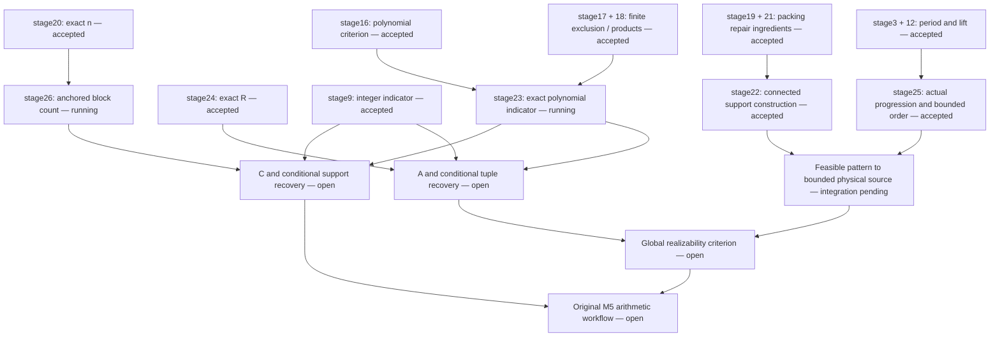

# Source-to-formal-proof chain

This is a status map of the original reviewed proof, not a strengthened theorem or a completion percentage. Exact source: [PROOF.md](../../../../research/quantum_m5/research_checkpoints/period_residue_arithmetic_law_reviewed/PROOF.md). For frozen target statements and acceptance receipts, follow the batch links. A successful identity is retained even while a larger source section remains incomplete.

| Original component | Formal status | Evidence / next dependency |
|---|---|---|
| §1 finite quotient period law and bound | Algebraic statements accepted; executable period computation remains | [stage3](stage3/RESULTS.md), [stage12](stage12/RESULTS.md) |
| §2 explicit subset n formula | Exact identity, integer division and nonnegativity accepted | [stage20](stage20/RESULTS.md) |
| §2 explicit repeated-tuple R formula | Exact identity, integer division and nonnegativity accepted | [stage24](stage24/RESULTS.md) |
| §3 integer connectivity indicator | Accepted | [stage9](stage9/RESULTS.md) |
| §3 polynomial exact-signature exclusion | Finite Boolean exclusion and factor products accepted; criterion accepted; final sum indicator under construction | [stage17](stage17/RESULTS.md), [stage18](stage18/RESULTS.md), [stage16](stage16/RESULTS.md) → stage23 |
| §3 anchored C and conditional recovery | Open; anchoring n to divisibility is running | stage20 → stage26, then polynomial/integer indicator assembly |
| §4 feasible-pattern A, necessity and recovery | Open; R identity available | stage24 plus polynomial/integer indicators, tuple recovery and reduction |
| §5 packing and signature preservation | Accepted components | [stage6](stage6/RESULTS.md), [stage8](stage8/RESULTS.md), [stage21](stage21/RESULTS.md) |
| §5 actual bounded connected support construction | Accepted | stage19 + stage21 → stage22 |
| §5 literal-support progression and bounded physical order | Accepted | stage12 + earlier bounded progression → stage25; combine with stage22 |
| §6 bounded exact birth and all later-order decisions | Open | C/A and recovery, bounded construction, necessary lower bounds |
| §1 weight-one boundary and final arithmetic procedure | Open | Boundary theorem and full correctness/termination integration |

The scheduler only releases proved dependencies. Independent ready nodes may run in parallel; the configured proof-worker ceiling is16. Noncomputable character coordinates currently support algebraic correctness; a terminating executable realization remains part of the original arithmetic procedure, not an extra efficiency goal. No distance, inherited-intersection, or anchored-sorting goal is added.
