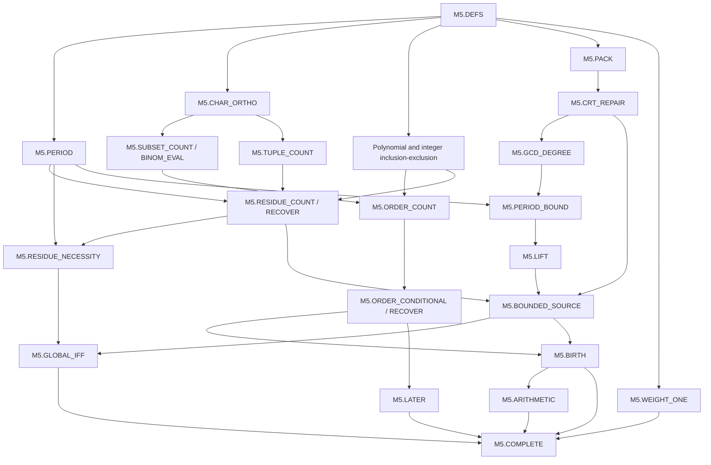

# M5 formalization dependency roadmap

Status: a source-linked decomposition of the reviewed natural-language argument, **not a claim that M5 has been formalized**. A roadmap node becomes executable only after its Lean statement and imports are frozen in a reviewed spec. Passing a foundation experiment does not complete the corresponding larger theorem node.

## Source and acceptance target

Source: `quantum_code_discovery_proof/research_checkpoints/period_residue_arithmetic_law_reviewed/PROOF.md`, read on 2026-09-15. SHA-256 of the exact file, including the later adoption preamble:

`a7c0e2ae5f555864340f4b3e6d6674e5b2e74abf382ca5de4d3e5d68da6951a3`

The submitted proof identifier `5f23d6908129f246885865e3ccb27f7138ebb3dcd5246010998a84d50b49f770` is a different provenance identifier; it must not be substituted for this file hash. The opening historical audit-pending wording is preserved in the source; it is not the current adoption status.

The root obligation is the original arithmetic M5 statement: for every monic binary polynomial F with F(0)=1 and positive support weight, determine global connected realizability, give the explicit birth bound when realizable, compute exact birth, classify every proposed later order, and recover a recipe from a positive count. The formulas must be explicit divisor/character arithmetic, rather than an unevaluated existence predicate or raw support-pair search. Exponential character enumeration is permitted. This route does not add a distance theorem, efficient complexity bound, inherited-intersection theorem, anchored sorting, or classification of quantum-code equivalence.

The proposed definitions and theorem statements require correspondence review against the source before they are frozen. In particular, a proof of the same conclusion under an added existence assumption is not a substitute for the bounded-source theorem.

## Shared definitions: freeze before dependent proof work

Node `M5.DEFS` (source §1–4) fixes one shared Lean namespace and representation for:

- Binary polynomials, monic complete signatures, `M N = X^N + 1`, and the positive period `t F`, explicitly including `t 1 = 1`.
- Anchored ordered supports as finite subsets of `Fin N` of cardinality w containing zero; ordinary support polynomials; connectivity through the integer gcd of N and all exponents; exact complete gcd with multiplicities. Counts are not equivalence-class counts.
- Residue tuples of length w with initial coordinate zero, allowing repeated residues and zero residue polynomials; their feasibility at period T.
- The finite additive-character sums `n` and `R`, polynomial radical factors, integer Möbius factors, `C`, `A`, the explicit cutoff L and bound B. Out-of-range subset counts are zero and empty tuple counts use the usual zeroth-power convention.
- The conclusion record for the arithmetic procedure, including soundness of zero counts and witness reconstruction. Keep total definitions separate from hypotheses restricting meaningful parameters.

Do not permit concurrent agents to invent incompatible versions of these objects. Foundational experiments using standard Mathlib objects can run before this freeze, but are not substitutes for it.

## Source-linked proof DAG

Each prerequisite list is a direct proof dependency proposal. Lean elaboration may expose missing edges; any change to a frozen statement invalidates its dependent acceptance records. Every row initially has status **planned**, unless a separate acceptance receipt names its exact frozen statement and source digest.

| Stable node ID | Source | Required result | Direct prerequisites |
|---|---|---|---|
| `M5.DEFS` | §1–4 | Shared objects and exact root statement; definition correspondence review | — |
| `M5.PERIOD` | §1, §4–5 | Existence/computation of t(F), `F ∣ M N ↔ t(F) ∣ N` for positive N; repeated factors and F=1 | `M5.DEFS` |
| `M5.TRANSLATE` | §1 | Anchoring by independent translations preserves signature and connectivity | `M5.DEFS` |
| `M5.CHAR_ORTHO` | §2 | Binary additive-character orthogonality, including dimension zero | `M5.DEFS` |
| `M5.SUBSET_COUNT` | §2 | Character product coefficient equals the k-subset residue count | `M5.CHAR_ORTHO` |
| `M5.BINOM_EVAL` | §2 | Signed binomial coefficient formula evaluates that coefficient without subset enumeration | `M5.SUBSET_COUNT` |
| `M5.TUPLE_COUNT` | §2 | Character power sum counts ordered residue tuples with repetition, including length zero | `M5.CHAR_ORTHO` |
| `M5.POLY_IE` | §3 | Squarefree divisors of `rad(M_N/F)` detect exact complete gcd, retaining the next multiplicity exclusion | `M5.DEFS` |
| `M5.INT_IE` | §3 | Integer divisor Möbius indicator detects combined support gcd one | `M5.DEFS` |
| `M5.ORDER_COUNT` | §3 | C equals the number of connected anchored weight-w pairs of exact signature F; inadmissible cases zero | `M5.SUBSET_COUNT`, `M5.POLY_IE`, `M5.INT_IE` |
| `M5.ORDER_CONDITIONAL` | §3 | Selected/available completion formula is exact for both blocks | `M5.ORDER_COUNT` |
| `M5.ORDER_RECOVER` | §3 | Positive C deterministically yields a valid pair in at most `2(N-1)` position decisions | `M5.ORDER_CONDITIONAL` |
| `M5.RESIDUE_COUNT` | §4 | A equals the number of feasible anchored ordered residue patterns | `M5.PERIOD`, `M5.TUPLE_COUNT`, `M5.POLY_IE`, `M5.INT_IE` |
| `M5.RESIDUE_RECOVER` | §4 | Conditional tuple counts recover a feasible pattern in at most `2(w-1)T` candidate tests | `M5.RESIDUE_COUNT` |
| `M5.RESIDUE_NECESSITY` | §4 | Every connected physical source reduces to a feasible period pattern | `M5.PERIOD`, `M5.TRANSLATE`, `M5.RESIDUE_COUNT` |
| `M5.PACK` | §5 | Pack each residue's multiplicities into distinct anchored exponents at most `wT-1`, preserving reduction | `M5.DEFS` |
| `M5.CRT_REPAIR` | §5 | A shift of one positive first-block exponent by kT makes total support gcd one, preserving weight and residues, with every exponent below `wT(T+2)` | `M5.PACK` |
| `M5.GCD_DEGREE` | §5 | Ordinary G has constant term one, `gcd(G,M_T)=F`, and degree at most `wT-1` because the second block is unchanged | `M5.CRT_REPAIR` |
| `M5.PERIOD_BOUND` | §5 | `E=t(G) ≤ 2^deg(G)` and `T ∣ E`, including G=1 | `M5.PERIOD`, `M5.GCD_DEGREE` |
| `M5.LIFT` | §5 | Same literal supports have exact F at all `N=T+jE` above their support cutoff; ring congruence preserves multiplicities | `M5.GCD_DEGREE`, `M5.PERIOD_BOUND` |
| `M5.BOUNDED_SOURCE` | §5 | Positive A constructs a connected source below `B=wT(T+2)+2^(wT)` and an infinite progression | `M5.RESIDUE_RECOVER`, `M5.CRT_REPAIR`, `M5.PERIOD_BOUND`, `M5.LIFT` |
| `M5.GLOBAL_IFF` | §4–6 | `A>0` iff any-order connected realization exists; A=0 is a global nonrealizability certificate | `M5.RESIDUE_NECESSITY`, `M5.BOUNDED_SOURCE` |
| `M5.LOWER_ORDERS` | §1, §6 | A realization requires `T ∣ N` and `max(w,deg(F)+1) ≤ N` | `M5.PERIOD`, `M5.DEFS` |
| `M5.BIRTH` | §6 | The bounded minimum of positive C values is nonempty and is the exact first birth; recover its witness | `M5.BOUNDED_SOURCE`, `M5.LOWER_ORDERS`, `M5.ORDER_COUNT`, `M5.ORDER_RECOVER` |
| `M5.LATER` | §6 | Every proposed order is classified by exact C; positive reconstructs and zero proves sector absence | `M5.ORDER_COUNT`, `M5.ORDER_RECOVER` |
| `M5.ARITHMETIC` | §2–6 | All invoked evaluations are finite factorization, divisor, character, power and binomial arithmetic; reconstruction terminates without raw pair scans | `M5.BINOM_EVAL`, `M5.TUPLE_COUNT`, `M5.PERIOD`, `M5.RESIDUE_RECOVER`, `M5.ORDER_RECOVER`, `M5.BIRTH` |
| `M5.WEIGHT_ONE` | §1 | At w=1 the only connected anchored source is N=1 with F=1 | `M5.DEFS` |
| `M5.COMPLETE` | §1, §6 | Assemble the full original arithmetic M5 theorem for all positive weights and complete signatures | `M5.GLOBAL_IFF`, `M5.BIRTH`, `M5.LATER`, `M5.ARITHMETIC`, `M5.WEIGHT_ONE` |

The source states a strict construction bound; keep its explicit inequality rather than weakening the executable search interval accidentally. A finite ring/cardinality proof alone establishes existence of a period but does not by itself implement the arithmetic procedure. `M5.ARITHMETIC` must connect the expressions and recovery code to their correctness statements. Kernel-checked theorem proofs can be noncomputable while the claimed evaluation algorithm needs an explicit terminating realization or a clearly identified remaining gap.

The diagram groups nodes for readability; the table is the dependency specification proposal. Neither is yet a machine-checked DAG of frozen Lean specs.

## Optional source corollaries, outside the root gate

The §7 weight-three sharpening can be formalized after its own prerequisites: distinct residues for nonconstant F (`M5.RESIDUE_COUNT`), exact birth at T (`M5.RESIDUE_NECESSITY` and the physical pattern construction), squarefreeness (derivative and connectivity arguments), and the explicit F=1 family with birth four. These preserve useful accepted subresults but are not extra requirements for `M5.COMPLETE`. The weight-zero convention, if explored, is outside the positive-weight target. §8 finite numerical tests are evidence, never premises of the unbounded theorem. Distance computations belong to a separate DAG.

## Scheduling with 16 available workers

Use 16 as a concurrency ceiling, not a target number of invented obligations. After shared definitions are fixed, the period, character, polynomial inclusion-exclusion, integer inclusion-exclusion, packing, and weight-one branches are independent. Each can be decomposed further when its precise statements justify it. Once character orthogonality passes, subset and repeated-tuple counting run independently. Fixed-order reconstruction and bounded-source construction can then progress concurrently. Assembly waits for their actual accepted artifacts.

A ready node has a frozen statement, all declared prerequisite receipts accepted, and an isolated output module. A worker executes the existing retrieval → proof → compile/repair → acceptance flow, with retrieval against both Mathlib and Physlib recorded separately. A missing library result is not a failed theorem. A scheduler releases downstream work only after checking receipts, exact artifact hashes, and imported dependencies. It must distinguish blocked dependencies, failed compilation, exhausted proof budget, and semantic rejection; none means that M5 is false.

Only one owner changes a shared definition file. Other workers write separate modules in isolated build workspaces; integration freezes dependency modules before they are imported by downstream nodes. Do not run 16 concurrent mutations of one Lake build directory. Proof attempt names and output directories must be unique. A corrected definition or statement invalidates the affected descendant receipts, while unrelated accepted branches remain reusable. Final acceptance recompiles the root from the frozen dependency closure and audits its axioms.

## First executable experiments

Initial experiments should use ordinary Mathlib types, freeze small literal statements, and record their limited relationship to this roadmap:

1. Polynomial constant coefficient: `(X^N + 1).coeff 0 = 1` over `ZMod 2` when `0 < N`. This is a small prerequisite of `M5.PERIOD`, not the period theorem.
2. Polynomial divisibility under a multiple exponent: `a ∣ b` implies `X^a + 1 ∣ X^b + 1` over `ZMod 2`. This checks characteristic-two polynomial and divisibility interfaces needed by the period branch.
3. Packing arithmetic: for positive T, `r<T` and `j<w` imply `r+j*T<w*T`; and quotient/remainder uniqueness makes `(r,j) ↦ r+j*T` injective on this domain. These are helper lemmas for `M5.PACK`, not the full anchored multiset packing construction.
4. Finite subset split: partition eligible subsets according to membership of one chosen position and derive the cardinality recurrence. This is a helper for `M5.ORDER_RECOVER`; residue and signature constraints must still be added in later nodes.

These experiments can run concurrently once their own specs are frozen. Their manifests must label them as foundation experiments, leaving `M5.COMPLETE` and all unproved larger obligations explicitly pending. A generic algebra smoke test is not credited as proof of an M5-specific theorem.
