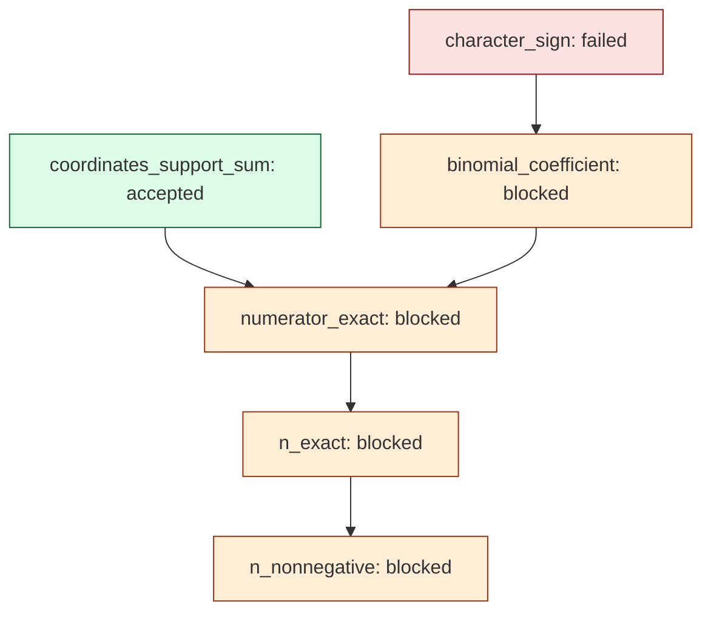

```mermaid
flowchart TD
    character_sign["character_sign: failed"]:::failed
    coordinates_support_sum["coordinates_support_sum: accepted"]:::accepted
    binomial_coefficient["binomial_coefficient: blocked"]:::blocked
    character_sign --> binomial_coefficient
    numerator_exact["numerator_exact: blocked"]:::blocked
    coordinates_support_sum --> numerator_exact
    binomial_coefficient --> numerator_exact
    n_exact["n_exact: blocked"]:::blocked
    numerator_exact --> n_exact
    n_nonnegative["n_nonnegative: blocked"]:::blocked
    n_exact --> n_nonnegative
    classDef accepted fill:#dcfce7,stroke:#166534
    classDef running fill:#dbeafe,stroke:#1d4ed8
    classDef planned fill:#f3f4f6,stroke:#6b7280,stroke-dasharray:5 5
    classDef failed fill:#fee2e2,stroke:#991b1b
    classDef blocked fill:#ffedd5,stroke:#9a3412
```
