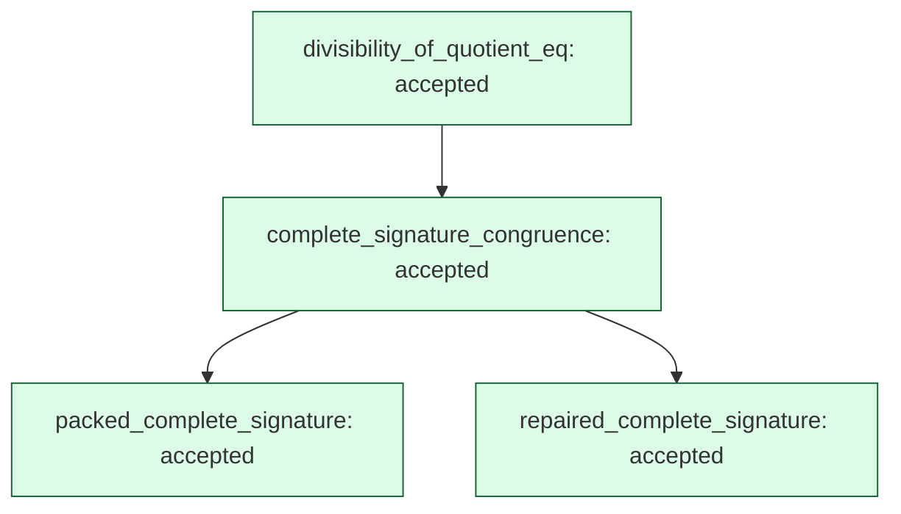

```mermaid
flowchart TD
    divisibility_of_quotient_eq["divisibility_of_quotient_eq: accepted"]:::accepted
    complete_signature_congruence["complete_signature_congruence: accepted"]:::accepted
    divisibility_of_quotient_eq --> complete_signature_congruence
    packed_complete_signature["packed_complete_signature: accepted"]:::accepted
    complete_signature_congruence --> packed_complete_signature
    repaired_complete_signature["repaired_complete_signature: accepted"]:::accepted
    complete_signature_congruence --> repaired_complete_signature
    classDef accepted fill:#dcfce7,stroke:#166534
    classDef running fill:#dbeafe,stroke:#1d4ed8
    classDef planned fill:#f3f4f6,stroke:#6b7280,stroke-dasharray:5 5
    classDef failed fill:#fee2e2,stroke:#991b1b
    classDef blocked fill:#ffedd5,stroke:#9a3412
```
