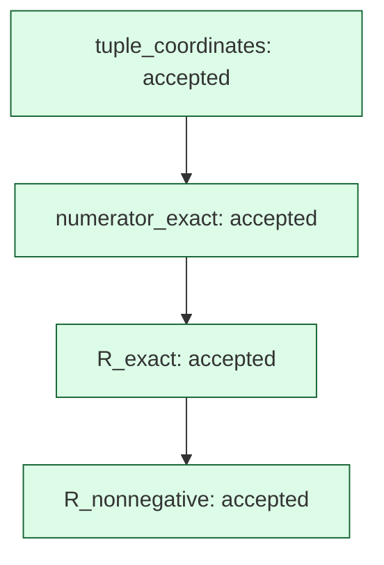

```mermaid
flowchart TD
    tuple_coordinates["tuple_coordinates: accepted"]:::accepted
    numerator_exact["numerator_exact: accepted"]:::accepted
    tuple_coordinates --> numerator_exact
    R_exact["R_exact: accepted"]:::accepted
    numerator_exact --> R_exact
    R_nonnegative["R_nonnegative: accepted"]:::accepted
    R_exact --> R_nonnegative
    classDef accepted fill:#dcfce7,stroke:#166534
    classDef running fill:#dbeafe,stroke:#1d4ed8
    classDef planned fill:#f3f4f6,stroke:#6b7280,stroke-dasharray:5 5
    classDef failed fill:#fee2e2,stroke:#991b1b
    classDef blocked fill:#ffedd5,stroke:#9a3412
```
