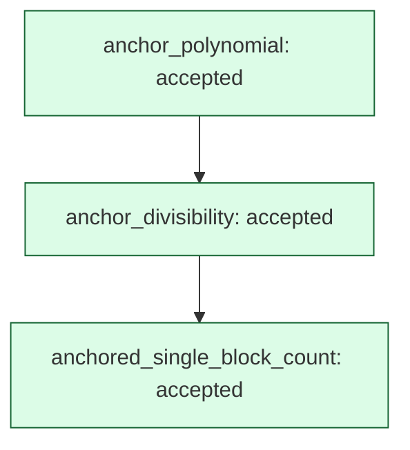

```mermaid
flowchart TD
    anchor_polynomial["anchor_polynomial: accepted"]:::accepted
    anchor_divisibility["anchor_divisibility: accepted"]:::accepted
    anchor_polynomial --> anchor_divisibility
    anchored_single_block_count["anchored_single_block_count: accepted"]:::accepted
    anchor_divisibility --> anchored_single_block_count
    classDef accepted fill:#dcfce7,stroke:#166534
    classDef running fill:#dbeafe,stroke:#1d4ed8
    classDef planned fill:#f3f4f6,stroke:#6b7280,stroke-dasharray:5 5
    classDef failed fill:#fee2e2,stroke:#991b1b
    classDef blocked fill:#ffedd5,stroke:#9a3412
```
