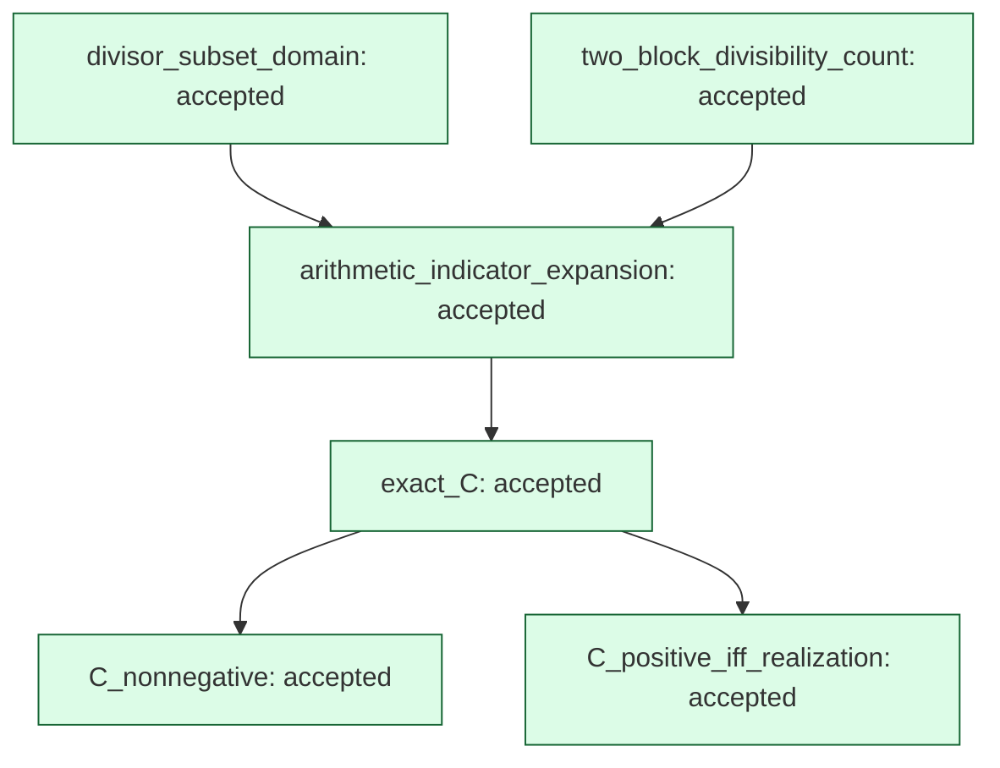

```mermaid
flowchart TD
    divisor_subset_domain["divisor_subset_domain: accepted"]:::accepted
    two_block_divisibility_count["two_block_divisibility_count: accepted"]:::accepted
    arithmetic_indicator_expansion["arithmetic_indicator_expansion: accepted"]:::accepted
    divisor_subset_domain --> arithmetic_indicator_expansion
    two_block_divisibility_count --> arithmetic_indicator_expansion
    exact_C["exact_C: accepted"]:::accepted
    arithmetic_indicator_expansion --> exact_C
    C_nonnegative["C_nonnegative: accepted"]:::accepted
    exact_C --> C_nonnegative
    C_positive_iff_realization["C_positive_iff_realization: accepted"]:::accepted
    exact_C --> C_positive_iff_realization
    classDef accepted fill:#dcfce7,stroke:#166534
    classDef running fill:#dbeafe,stroke:#1d4ed8
    classDef planned fill:#f3f4f6,stroke:#6b7280,stroke-dasharray:5 5
    classDef failed fill:#fee2e2,stroke:#991b1b
    classDef blocked fill:#ffedd5,stroke:#9a3412
```
