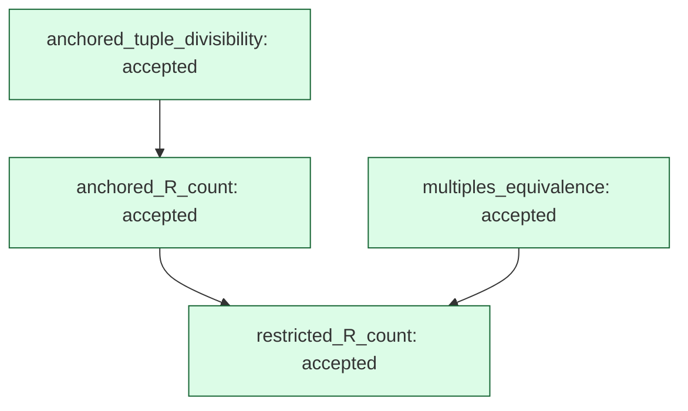

```mermaid
flowchart TD
    anchored_tuple_divisibility["anchored_tuple_divisibility: accepted"]:::accepted
    anchored_R_count["anchored_R_count: accepted"]:::accepted
    anchored_tuple_divisibility --> anchored_R_count
    multiples_equivalence["multiples_equivalence: accepted"]:::accepted
    restricted_R_count["restricted_R_count: accepted"]:::accepted
    anchored_R_count --> restricted_R_count
    multiples_equivalence --> restricted_R_count
    classDef accepted fill:#dcfce7,stroke:#166534
    classDef running fill:#dbeafe,stroke:#1d4ed8
    classDef planned fill:#f3f4f6,stroke:#6b7280,stroke-dasharray:5 5
    classDef failed fill:#fee2e2,stroke:#991b1b
    classDef blocked fill:#ffedd5,stroke:#9a3412
```
