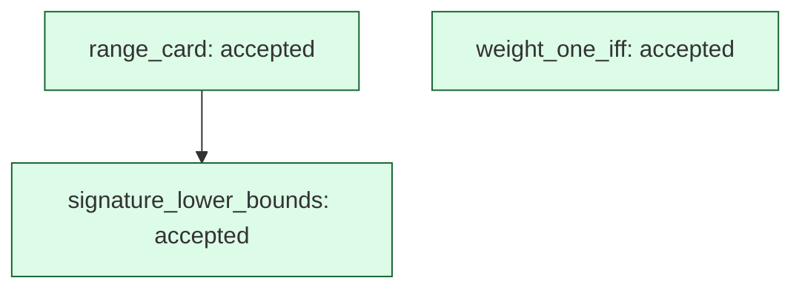

```mermaid
flowchart TD
    range_card["range_card: accepted"]:::accepted
    signature_lower_bounds["signature_lower_bounds: accepted"]:::accepted
    range_card --> signature_lower_bounds
    weight_one_iff["weight_one_iff: accepted"]:::accepted
    classDef accepted fill:#dcfce7,stroke:#166534
    classDef running fill:#dbeafe,stroke:#1d4ed8
    classDef planned fill:#f3f4f6,stroke:#6b7280,stroke-dasharray:5 5
    classDef failed fill:#fee2e2,stroke:#991b1b
    classDef blocked fill:#ffedd5,stroke:#9a3412
```
