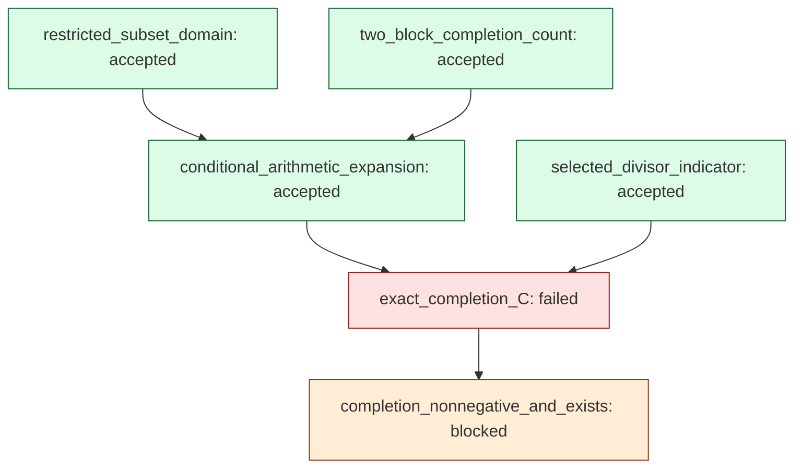

```mermaid
flowchart TD
    restricted_subset_domain["restricted_subset_domain: accepted"]:::accepted
    two_block_completion_count["two_block_completion_count: accepted"]:::accepted
    selected_divisor_indicator["selected_divisor_indicator: accepted"]:::accepted
    conditional_arithmetic_expansion["conditional_arithmetic_expansion: accepted"]:::accepted
    restricted_subset_domain --> conditional_arithmetic_expansion
    two_block_completion_count --> conditional_arithmetic_expansion
    exact_completion_C["exact_completion_C: failed"]:::failed
    conditional_arithmetic_expansion --> exact_completion_C
    selected_divisor_indicator --> exact_completion_C
    completion_nonnegative_and_exists["completion_nonnegative_and_exists: blocked"]:::blocked
    exact_completion_C --> completion_nonnegative_and_exists
    classDef accepted fill:#dcfce7,stroke:#166534
    classDef running fill:#dbeafe,stroke:#1d4ed8
    classDef planned fill:#f3f4f6,stroke:#6b7280,stroke-dasharray:5 5
    classDef failed fill:#fee2e2,stroke:#991b1b
    classDef blocked fill:#ffedd5,stroke:#9a3412
```
