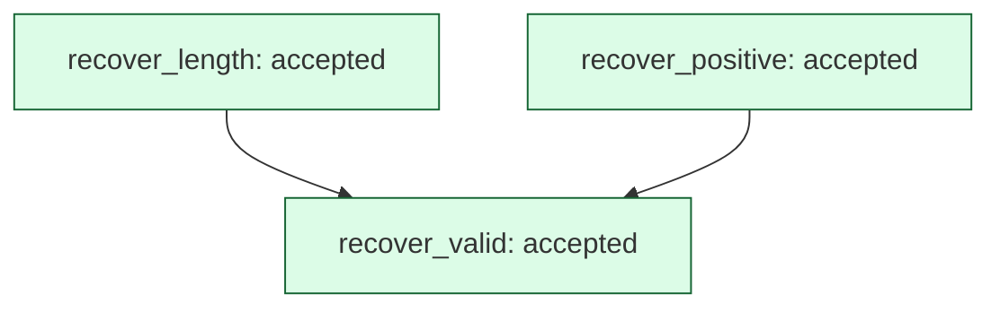

```mermaid
flowchart TD
    recover_length["recover_length: accepted"]:::accepted
    recover_positive["recover_positive: accepted"]:::accepted
    recover_valid["recover_valid: accepted"]:::accepted
    recover_length --> recover_valid
    recover_positive --> recover_valid
    classDef accepted fill:#dcfce7,stroke:#166534
    classDef running fill:#dbeafe,stroke:#1d4ed8
    classDef planned fill:#f3f4f6,stroke:#6b7280,stroke-dasharray:5 5
    classDef failed fill:#fee2e2,stroke:#991b1b
    classDef blocked fill:#ffedd5,stroke:#9a3412
```
