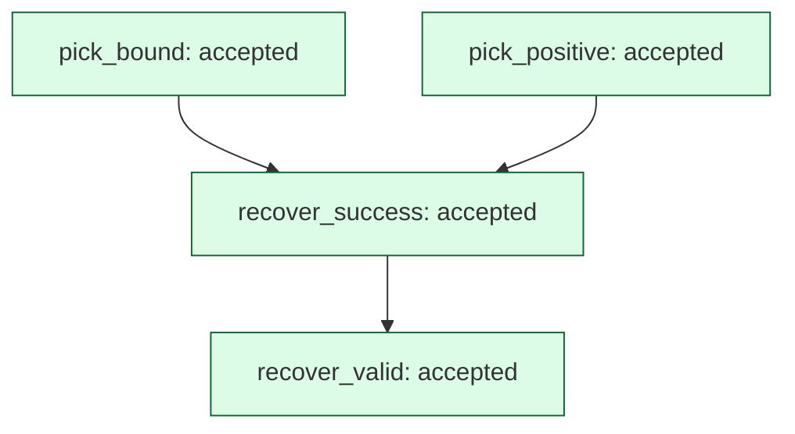

```mermaid
flowchart TD
    pick_bound["pick_bound: accepted"]:::accepted
    pick_positive["pick_positive: accepted"]:::accepted
    recover_success["recover_success: accepted"]:::accepted
    pick_bound --> recover_success
    pick_positive --> recover_success
    recover_valid["recover_valid: accepted"]:::accepted
    recover_success --> recover_valid
    classDef accepted fill:#dcfce7,stroke:#166534
    classDef running fill:#dbeafe,stroke:#1d4ed8
    classDef planned fill:#f3f4f6,stroke:#6b7280,stroke-dasharray:5 5
    classDef failed fill:#fee2e2,stroke:#991b1b
    classDef blocked fill:#ffedd5,stroke:#9a3412
```
