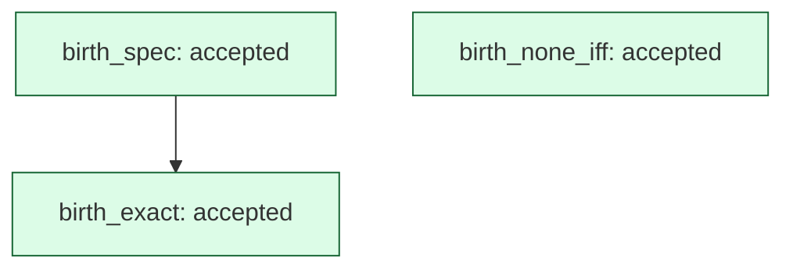

```mermaid
flowchart TD
    birth_spec["birth_spec: accepted"]:::accepted
    birth_exact["birth_exact: accepted"]:::accepted
    birth_spec --> birth_exact
    birth_none_iff["birth_none_iff: accepted"]:::accepted
    classDef accepted fill:#dcfce7,stroke:#166534
    classDef running fill:#dbeafe,stroke:#1d4ed8
    classDef planned fill:#f3f4f6,stroke:#6b7280,stroke-dasharray:5 5
    classDef failed fill:#fee2e2,stroke:#991b1b
    classDef blocked fill:#ffedd5,stroke:#9a3412
```
