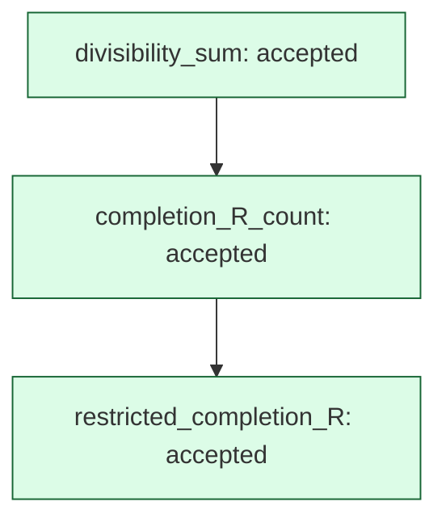

```mermaid
flowchart TD
    divisibility_sum["divisibility_sum: accepted"]:::accepted
    completion_R_count["completion_R_count: accepted"]:::accepted
    divisibility_sum --> completion_R_count
    restricted_completion_R["restricted_completion_R: accepted"]:::accepted
    completion_R_count --> restricted_completion_R
    classDef accepted fill:#dcfce7,stroke:#166534
    classDef running fill:#dbeafe,stroke:#1d4ed8
    classDef planned fill:#f3f4f6,stroke:#6b7280,stroke-dasharray:5 5
    classDef failed fill:#fee2e2,stroke:#991b1b
    classDef blocked fill:#ffedd5,stroke:#9a3412
```
