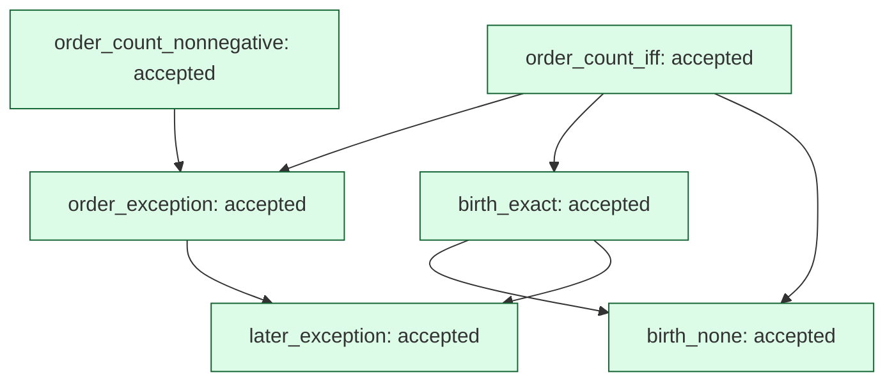

```mermaid
flowchart TD
    order_count_iff["order_count_iff: accepted"]:::accepted
    order_count_nonnegative["order_count_nonnegative: accepted"]:::accepted
    order_exception["order_exception: accepted"]:::accepted
    order_count_iff --> order_exception
    order_count_nonnegative --> order_exception
    birth_exact["birth_exact: accepted"]:::accepted
    order_count_iff --> birth_exact
    birth_none["birth_none: accepted"]:::accepted
    birth_exact --> birth_none
    order_count_iff --> birth_none
    later_exception["later_exception: accepted"]:::accepted
    birth_exact --> later_exception
    order_exception --> later_exception
    classDef accepted fill:#dcfce7,stroke:#166534
    classDef running fill:#dbeafe,stroke:#1d4ed8
    classDef planned fill:#f3f4f6,stroke:#6b7280,stroke-dasharray:5 5
    classDef failed fill:#fee2e2,stroke:#991b1b
    classDef blocked fill:#ffedd5,stroke:#9a3412
```
