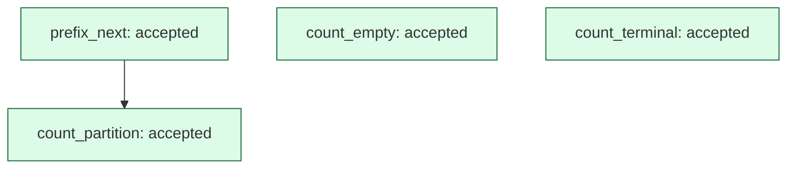

```mermaid
flowchart TD
    prefix_next["prefix_next: accepted"]:::accepted
    count_empty["count_empty: accepted"]:::accepted
    count_partition["count_partition: accepted"]:::accepted
    prefix_next --> count_partition
    count_terminal["count_terminal: accepted"]:::accepted
    classDef accepted fill:#dcfce7,stroke:#166534
    classDef running fill:#dbeafe,stroke:#1d4ed8
    classDef planned fill:#f3f4f6,stroke:#6b7280,stroke-dasharray:5 5
    classDef failed fill:#fee2e2,stroke:#991b1b
    classDef blocked fill:#ffedd5,stroke:#9a3412
```
