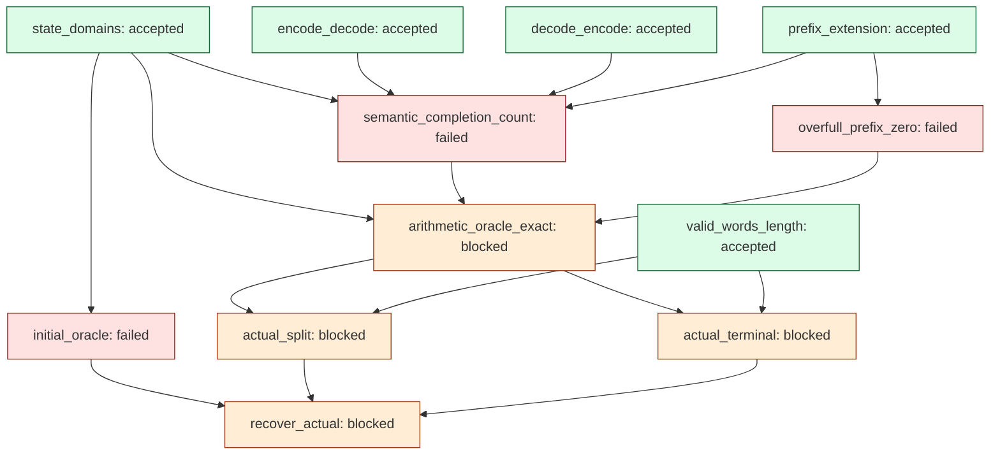

```mermaid
flowchart TD
    state_domains["state_domains: accepted"]:::accepted
    valid_words_length["valid_words_length: accepted"]:::accepted
    encode_decode["encode_decode: accepted"]:::accepted
    decode_encode["decode_encode: accepted"]:::accepted
    prefix_extension["prefix_extension: accepted"]:::accepted
    semantic_completion_count["semantic_completion_count: failed"]:::failed
    state_domains --> semantic_completion_count
    encode_decode --> semantic_completion_count
    decode_encode --> semantic_completion_count
    prefix_extension --> semantic_completion_count
    overfull_prefix_zero["overfull_prefix_zero: failed"]:::failed
    prefix_extension --> overfull_prefix_zero
    arithmetic_oracle_exact["arithmetic_oracle_exact: blocked"]:::blocked
    state_domains --> arithmetic_oracle_exact
    semantic_completion_count --> arithmetic_oracle_exact
    overfull_prefix_zero --> arithmetic_oracle_exact
    initial_oracle["initial_oracle: failed"]:::failed
    state_domains --> initial_oracle
    actual_split["actual_split: blocked"]:::blocked
    arithmetic_oracle_exact --> actual_split
    valid_words_length --> actual_split
    actual_terminal["actual_terminal: blocked"]:::blocked
    arithmetic_oracle_exact --> actual_terminal
    valid_words_length --> actual_terminal
    recover_actual["recover_actual: blocked"]:::blocked
    initial_oracle --> recover_actual
    actual_split --> recover_actual
    actual_terminal --> recover_actual
    classDef accepted fill:#dcfce7,stroke:#166534
    classDef running fill:#dbeafe,stroke:#1d4ed8
    classDef planned fill:#f3f4f6,stroke:#6b7280,stroke-dasharray:5 5
    classDef failed fill:#fee2e2,stroke:#991b1b
    classDef blocked fill:#ffedd5,stroke:#9a3412
```
