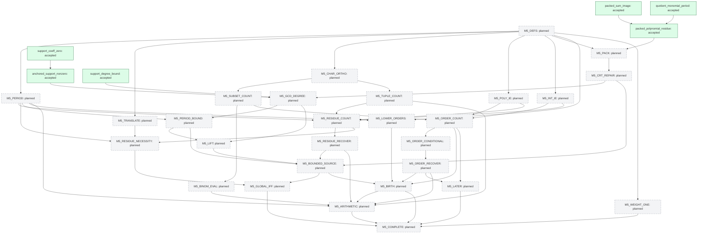

```mermaid
flowchart TD
    M5_DEFS["M5_DEFS: planned"]:::planned
    M5_PERIOD["M5_PERIOD: planned"]:::planned
    M5_DEFS --> M5_PERIOD
    M5_TRANSLATE["M5_TRANSLATE: planned"]:::planned
    M5_DEFS --> M5_TRANSLATE
    M5_CHAR_ORTHO["M5_CHAR_ORTHO: planned"]:::planned
    M5_DEFS --> M5_CHAR_ORTHO
    M5_SUBSET_COUNT["M5_SUBSET_COUNT: planned"]:::planned
    M5_CHAR_ORTHO --> M5_SUBSET_COUNT
    M5_BINOM_EVAL["M5_BINOM_EVAL: planned"]:::planned
    M5_SUBSET_COUNT --> M5_BINOM_EVAL
    M5_TUPLE_COUNT["M5_TUPLE_COUNT: planned"]:::planned
    M5_CHAR_ORTHO --> M5_TUPLE_COUNT
    M5_POLY_IE["M5_POLY_IE: planned"]:::planned
    M5_DEFS --> M5_POLY_IE
    M5_INT_IE["M5_INT_IE: planned"]:::planned
    M5_DEFS --> M5_INT_IE
    M5_ORDER_COUNT["M5_ORDER_COUNT: planned"]:::planned
    M5_SUBSET_COUNT --> M5_ORDER_COUNT
    M5_POLY_IE --> M5_ORDER_COUNT
    M5_INT_IE --> M5_ORDER_COUNT
    M5_ORDER_CONDITIONAL["M5_ORDER_CONDITIONAL: planned"]:::planned
    M5_ORDER_COUNT --> M5_ORDER_CONDITIONAL
    M5_ORDER_RECOVER["M5_ORDER_RECOVER: planned"]:::planned
    M5_ORDER_CONDITIONAL --> M5_ORDER_RECOVER
    M5_RESIDUE_COUNT["M5_RESIDUE_COUNT: planned"]:::planned
    M5_PERIOD --> M5_RESIDUE_COUNT
    M5_TUPLE_COUNT --> M5_RESIDUE_COUNT
    M5_POLY_IE --> M5_RESIDUE_COUNT
    M5_INT_IE --> M5_RESIDUE_COUNT
    M5_RESIDUE_RECOVER["M5_RESIDUE_RECOVER: planned"]:::planned
    M5_RESIDUE_COUNT --> M5_RESIDUE_RECOVER
    M5_RESIDUE_NECESSITY["M5_RESIDUE_NECESSITY: planned"]:::planned
    M5_PERIOD --> M5_RESIDUE_NECESSITY
    M5_TRANSLATE --> M5_RESIDUE_NECESSITY
    M5_RESIDUE_COUNT --> M5_RESIDUE_NECESSITY
    M5_PACK["M5_PACK: planned"]:::planned
    M5_DEFS --> M5_PACK
    packed_polynomial_residue --> M5_PACK
    M5_CRT_REPAIR["M5_CRT_REPAIR: planned"]:::planned
    M5_PACK --> M5_CRT_REPAIR
    M5_GCD_DEGREE["M5_GCD_DEGREE: planned"]:::planned
    M5_CRT_REPAIR --> M5_GCD_DEGREE
    support_degree_bound --> M5_GCD_DEGREE
    anchored_support_nonzero --> M5_GCD_DEGREE
    M5_PERIOD_BOUND["M5_PERIOD_BOUND: planned"]:::planned
    M5_PERIOD --> M5_PERIOD_BOUND
    M5_GCD_DEGREE --> M5_PERIOD_BOUND
    M5_LIFT["M5_LIFT: planned"]:::planned
    M5_GCD_DEGREE --> M5_LIFT
    M5_PERIOD_BOUND --> M5_LIFT
    M5_BOUNDED_SOURCE["M5_BOUNDED_SOURCE: planned"]:::planned
    M5_RESIDUE_RECOVER --> M5_BOUNDED_SOURCE
    M5_CRT_REPAIR --> M5_BOUNDED_SOURCE
    M5_PERIOD_BOUND --> M5_BOUNDED_SOURCE
    M5_LIFT --> M5_BOUNDED_SOURCE
    M5_GLOBAL_IFF["M5_GLOBAL_IFF: planned"]:::planned
    M5_RESIDUE_NECESSITY --> M5_GLOBAL_IFF
    M5_BOUNDED_SOURCE --> M5_GLOBAL_IFF
    M5_LOWER_ORDERS["M5_LOWER_ORDERS: planned"]:::planned
    M5_PERIOD --> M5_LOWER_ORDERS
    M5_DEFS --> M5_LOWER_ORDERS
    M5_BIRTH["M5_BIRTH: planned"]:::planned
    M5_BOUNDED_SOURCE --> M5_BIRTH
    M5_LOWER_ORDERS --> M5_BIRTH
    M5_ORDER_COUNT --> M5_BIRTH
    M5_ORDER_RECOVER --> M5_BIRTH
    M5_LATER["M5_LATER: planned"]:::planned
    M5_ORDER_COUNT --> M5_LATER
    M5_ORDER_RECOVER --> M5_LATER
    M5_ARITHMETIC["M5_ARITHMETIC: planned"]:::planned
    M5_BINOM_EVAL --> M5_ARITHMETIC
    M5_TUPLE_COUNT --> M5_ARITHMETIC
    M5_PERIOD --> M5_ARITHMETIC
    M5_RESIDUE_RECOVER --> M5_ARITHMETIC
    M5_ORDER_RECOVER --> M5_ARITHMETIC
    M5_BIRTH --> M5_ARITHMETIC
    M5_WEIGHT_ONE["M5_WEIGHT_ONE: planned"]:::planned
    M5_DEFS --> M5_WEIGHT_ONE
    M5_COMPLETE["M5_COMPLETE: planned"]:::planned
    M5_GLOBAL_IFF --> M5_COMPLETE
    M5_BIRTH --> M5_COMPLETE
    M5_LATER --> M5_COMPLETE
    M5_ARITHMETIC --> M5_COMPLETE
    M5_WEIGHT_ONE --> M5_COMPLETE
    support_coeff_zero["support_coeff_zero: accepted"]:::accepted
    anchored_support_nonzero["anchored_support_nonzero: accepted"]:::accepted
    support_coeff_zero --> anchored_support_nonzero
    support_degree_bound["support_degree_bound: accepted"]:::accepted
    packed_sum_image["packed_sum_image: accepted"]:::accepted
    quotient_monomial_period["quotient_monomial_period: accepted"]:::accepted
    packed_polynomial_residue["packed_polynomial_residue: accepted"]:::accepted
    packed_sum_image --> packed_polynomial_residue
    quotient_monomial_period --> packed_polynomial_residue
    classDef accepted fill:#dcfce7,stroke:#166534
    classDef running fill:#dbeafe,stroke:#1d4ed8
    classDef planned fill:#f3f4f6,stroke:#6b7280,stroke-dasharray:5 5
    classDef failed fill:#fee2e2,stroke:#991b1b
    classDef blocked fill:#ffedd5,stroke:#9a3412
```
