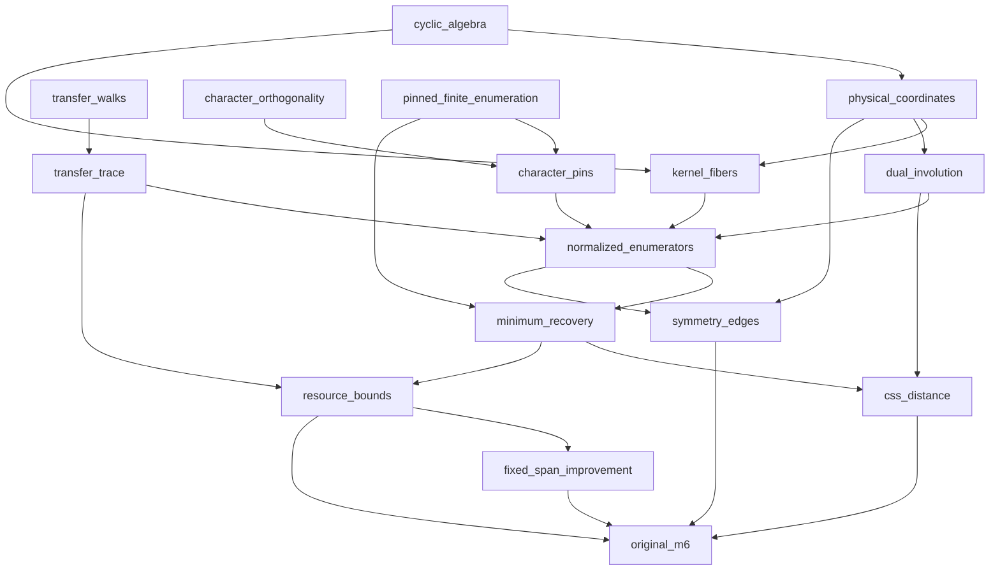

# M6 proof dependency graph

Independent first modules run concurrently; dependent targets run only after accepted proof imports. Module gates below are planned, not proof receipts.

The cyclic, transfer, character and pinned-enumeration roots are independent. Resource accounting starts from the actual transfer recurrence and joins witness-query bounds. Final acceptance waits for every original-scope branch.
