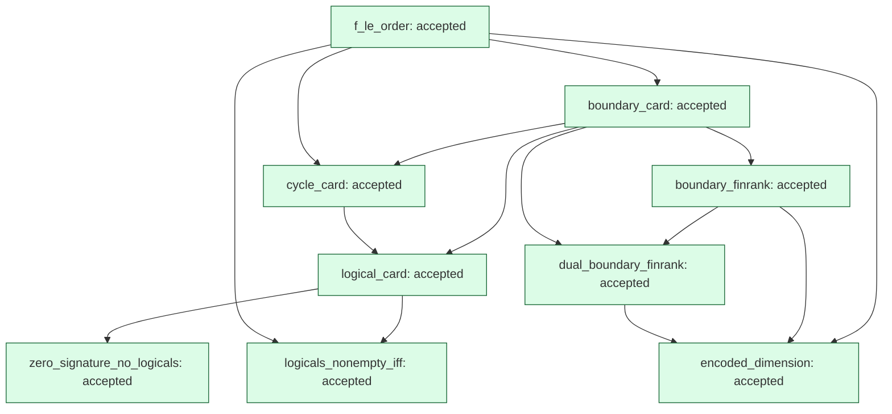

```mermaid
flowchart TD
    f_le_order["f_le_order: accepted"]:::accepted
    boundary_card["boundary_card: accepted"]:::accepted
    f_le_order --> boundary_card
    cycle_card["cycle_card: accepted"]:::accepted
    boundary_card --> cycle_card
    f_le_order --> cycle_card
    logical_card["logical_card: accepted"]:::accepted
    boundary_card --> logical_card
    cycle_card --> logical_card
    zero_signature_no_logicals["zero_signature_no_logicals: accepted"]:::accepted
    logical_card --> zero_signature_no_logicals
    logicals_nonempty_iff["logicals_nonempty_iff: accepted"]:::accepted
    logical_card --> logicals_nonempty_iff
    f_le_order --> logicals_nonempty_iff
    boundary_finrank["boundary_finrank: accepted"]:::accepted
    boundary_card --> boundary_finrank
    dual_boundary_finrank["dual_boundary_finrank: accepted"]:::accepted
    boundary_finrank --> dual_boundary_finrank
    boundary_card --> dual_boundary_finrank
    encoded_dimension["encoded_dimension: accepted"]:::accepted
    f_le_order --> encoded_dimension
    boundary_finrank --> encoded_dimension
    dual_boundary_finrank --> encoded_dimension
    classDef accepted fill:#dcfce7,stroke:#166534
    classDef running fill:#dbeafe,stroke:#1d4ed8
    classDef planned fill:#f3f4f6,stroke:#6b7280,stroke-dasharray:5 5
    classDef failed fill:#fee2e2,stroke:#991b1b
    classDef blocked fill:#ffedd5,stroke:#9a3412
```
