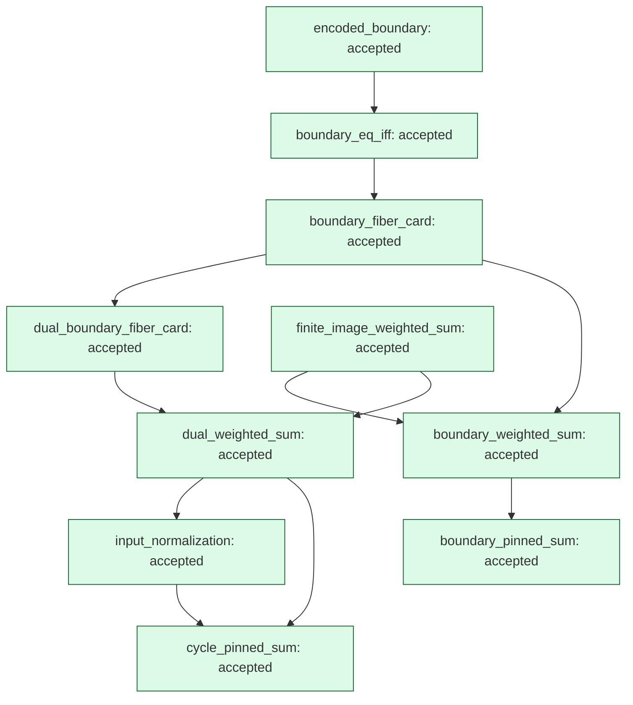

```mermaid
flowchart TD
    encoded_boundary["encoded_boundary: accepted"]:::accepted
    boundary_eq_iff["boundary_eq_iff: accepted"]:::accepted
    encoded_boundary --> boundary_eq_iff
    boundary_fiber_card["boundary_fiber_card: accepted"]:::accepted
    boundary_eq_iff --> boundary_fiber_card
    dual_boundary_fiber_card["dual_boundary_fiber_card: accepted"]:::accepted
    boundary_fiber_card --> dual_boundary_fiber_card
    finite_image_weighted_sum["finite_image_weighted_sum: accepted"]:::accepted
    boundary_weighted_sum["boundary_weighted_sum: accepted"]:::accepted
    boundary_fiber_card --> boundary_weighted_sum
    finite_image_weighted_sum --> boundary_weighted_sum
    dual_weighted_sum["dual_weighted_sum: accepted"]:::accepted
    dual_boundary_fiber_card --> dual_weighted_sum
    finite_image_weighted_sum --> dual_weighted_sum
    input_normalization["input_normalization: accepted"]:::accepted
    dual_weighted_sum --> input_normalization
    boundary_pinned_sum["boundary_pinned_sum: accepted"]:::accepted
    boundary_weighted_sum --> boundary_pinned_sum
    cycle_pinned_sum["cycle_pinned_sum: accepted"]:::accepted
    dual_weighted_sum --> cycle_pinned_sum
    input_normalization --> cycle_pinned_sum
    classDef accepted fill:#dcfce7,stroke:#166534
    classDef running fill:#dbeafe,stroke:#1d4ed8
    classDef planned fill:#f3f4f6,stroke:#6b7280,stroke-dasharray:5 5
    classDef failed fill:#fee2e2,stroke:#991b1b
    classDef blocked fill:#ffedd5,stroke:#9a3412
```
