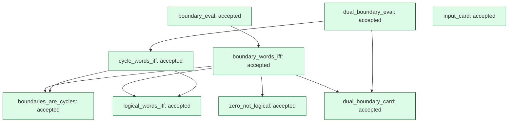

```mermaid
flowchart TD
    boundary_eval["boundary_eval: accepted"]:::accepted
    dual_boundary_eval["dual_boundary_eval: accepted"]:::accepted
    boundary_words_iff["boundary_words_iff: accepted"]:::accepted
    boundary_eval --> boundary_words_iff
    cycle_words_iff["cycle_words_iff: accepted"]:::accepted
    dual_boundary_eval --> cycle_words_iff
    boundaries_are_cycles["boundaries_are_cycles: accepted"]:::accepted
    boundary_words_iff --> boundaries_are_cycles
    cycle_words_iff --> boundaries_are_cycles
    logical_words_iff["logical_words_iff: accepted"]:::accepted
    boundary_words_iff --> logical_words_iff
    cycle_words_iff --> logical_words_iff
    zero_not_logical["zero_not_logical: accepted"]:::accepted
    boundary_words_iff --> zero_not_logical
    dual_boundary_card["dual_boundary_card: accepted"]:::accepted
    boundary_words_iff --> dual_boundary_card
    dual_boundary_eval --> dual_boundary_card
    input_card["input_card: accepted"]:::accepted
    classDef accepted fill:#dcfce7,stroke:#166534
    classDef running fill:#dbeafe,stroke:#1d4ed8
    classDef planned fill:#f3f4f6,stroke:#6b7280,stroke-dasharray:5 5
    classDef failed fill:#fee2e2,stroke:#991b1b
    classDef blocked fill:#ffedd5,stroke:#9a3412
```
