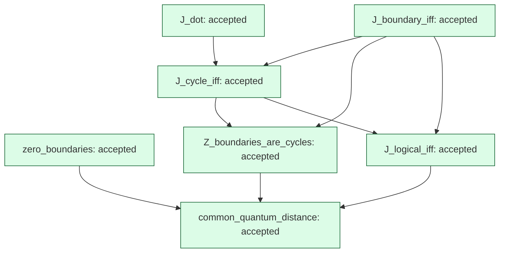

```mermaid
flowchart TD
    J_dot["J_dot: accepted"]:::accepted
    J_boundary_iff["J_boundary_iff: accepted"]:::accepted
    J_cycle_iff["J_cycle_iff: accepted"]:::accepted
    J_dot --> J_cycle_iff
    J_boundary_iff --> J_cycle_iff
    zero_boundaries["zero_boundaries: accepted"]:::accepted
    Z_boundaries_are_cycles["Z_boundaries_are_cycles: accepted"]:::accepted
    J_boundary_iff --> Z_boundaries_are_cycles
    J_cycle_iff --> Z_boundaries_are_cycles
    J_logical_iff["J_logical_iff: accepted"]:::accepted
    J_boundary_iff --> J_logical_iff
    J_cycle_iff --> J_logical_iff
    common_quantum_distance["common_quantum_distance: accepted"]:::accepted
    zero_boundaries --> common_quantum_distance
    Z_boundaries_are_cycles --> common_quantum_distance
    J_logical_iff --> common_quantum_distance
    classDef accepted fill:#dcfce7,stroke:#166534
    classDef running fill:#dbeafe,stroke:#1d4ed8
    classDef planned fill:#f3f4f6,stroke:#6b7280,stroke-dasharray:5 5
    classDef failed fill:#fee2e2,stroke:#991b1b
    classDef blocked fill:#ffedd5,stroke:#9a3412
```
