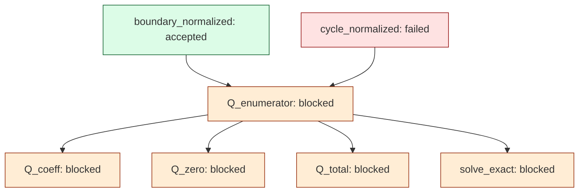

```mermaid
flowchart TD
    boundary_normalized["boundary_normalized: accepted"]:::accepted
    cycle_normalized["cycle_normalized: failed"]:::failed
    Q_enumerator["Q_enumerator: blocked"]:::blocked
    boundary_normalized --> Q_enumerator
    cycle_normalized --> Q_enumerator
    Q_coeff["Q_coeff: blocked"]:::blocked
    Q_enumerator --> Q_coeff
    Q_zero["Q_zero: blocked"]:::blocked
    Q_enumerator --> Q_zero
    Q_total["Q_total: blocked"]:::blocked
    Q_enumerator --> Q_total
    solve_exact["solve_exact: blocked"]:::blocked
    Q_enumerator --> solve_exact
    classDef accepted fill:#dcfce7,stroke:#166534
    classDef running fill:#dbeafe,stroke:#1d4ed8
    classDef planned fill:#f3f4f6,stroke:#6b7280,stroke-dasharray:5 5
    classDef failed fill:#fee2e2,stroke:#991b1b
    classDef blocked fill:#ffedd5,stroke:#9a3412
```
