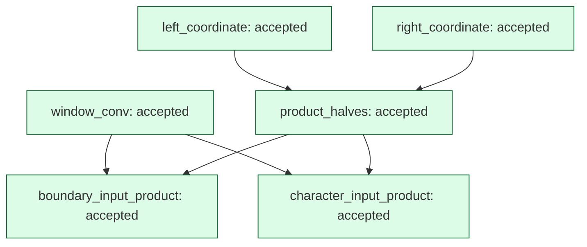

```mermaid
flowchart TD
    left_coordinate["left_coordinate: accepted"]:::accepted
    right_coordinate["right_coordinate: accepted"]:::accepted
    product_halves["product_halves: accepted"]:::accepted
    left_coordinate --> product_halves
    right_coordinate --> product_halves
    window_conv["window_conv: accepted"]:::accepted
    boundary_input_product["boundary_input_product: accepted"]:::accepted
    window_conv --> boundary_input_product
    product_halves --> boundary_input_product
    character_input_product["character_input_product: accepted"]:::accepted
    window_conv --> character_input_product
    product_halves --> character_input_product
    classDef accepted fill:#dcfce7,stroke:#166534
    classDef running fill:#dbeafe,stroke:#1d4ed8
    classDef planned fill:#f3f4f6,stroke:#6b7280,stroke-dasharray:5 5
    classDef failed fill:#fee2e2,stroke:#991b1b
    classDef blocked fill:#ffedd5,stroke:#9a3412
```
