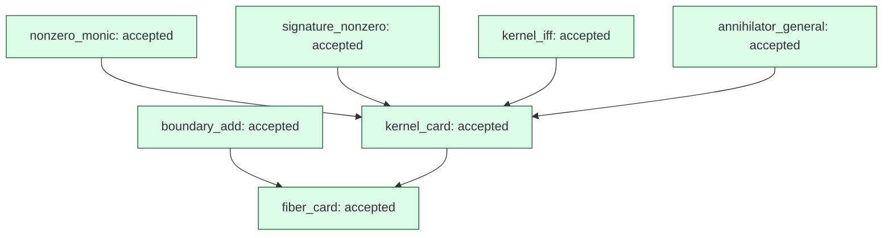

```mermaid
flowchart TD
    nonzero_monic["nonzero_monic: accepted"]:::accepted
    signature_nonzero["signature_nonzero: accepted"]:::accepted
    boundary_add["boundary_add: accepted"]:::accepted
    kernel_iff["kernel_iff: accepted"]:::accepted
    annihilator_general["annihilator_general: accepted"]:::accepted
    kernel_card["kernel_card: accepted"]:::accepted
    nonzero_monic --> kernel_card
    signature_nonzero --> kernel_card
    kernel_iff --> kernel_card
    annihilator_general --> kernel_card
    fiber_card["fiber_card: accepted"]:::accepted
    boundary_add --> fiber_card
    kernel_card --> fiber_card
    classDef accepted fill:#dcfce7,stroke:#166534
    classDef running fill:#dbeafe,stroke:#1d4ed8
    classDef planned fill:#f3f4f6,stroke:#6b7280,stroke-dasharray:5 5
    classDef failed fill:#fee2e2,stroke:#991b1b
    classDef blocked fill:#ffedd5,stroke:#9a3412
```
