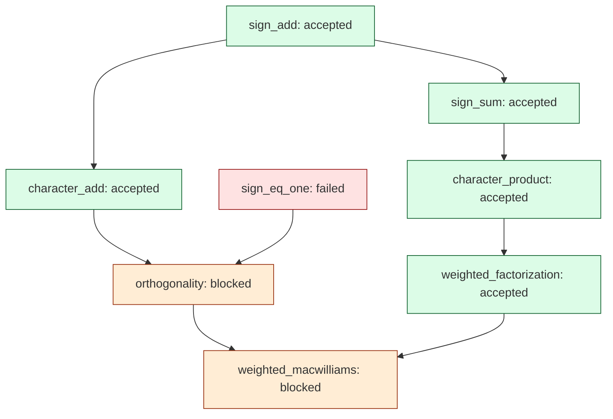

```mermaid
flowchart TD
    sign_add["sign_add: accepted"]:::accepted
    sign_eq_one["sign_eq_one: failed"]:::failed
    sign_sum["sign_sum: accepted"]:::accepted
    sign_add --> sign_sum
    character_add["character_add: accepted"]:::accepted
    sign_add --> character_add
    character_product["character_product: accepted"]:::accepted
    sign_sum --> character_product
    orthogonality["orthogonality: blocked"]:::blocked
    character_add --> orthogonality
    sign_eq_one --> orthogonality
    weighted_factorization["weighted_factorization: accepted"]:::accepted
    character_product --> weighted_factorization
    weighted_macwilliams["weighted_macwilliams: blocked"]:::blocked
    orthogonality --> weighted_macwilliams
    weighted_factorization --> weighted_macwilliams
    classDef accepted fill:#dcfce7,stroke:#166534
    classDef running fill:#dbeafe,stroke:#1d4ed8
    classDef planned fill:#f3f4f6,stroke:#6b7280,stroke-dasharray:5 5
    classDef failed fill:#fee2e2,stroke:#991b1b
    classDef blocked fill:#ffedd5,stroke:#9a3412
```
