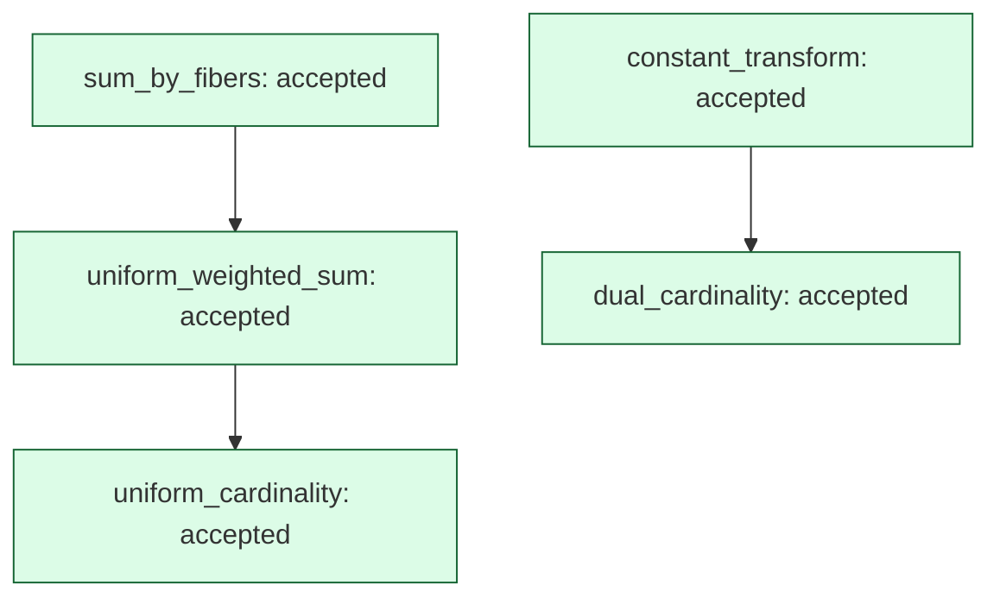

```mermaid
flowchart TD
    sum_by_fibers["sum_by_fibers: accepted"]:::accepted
    uniform_weighted_sum["uniform_weighted_sum: accepted"]:::accepted
    sum_by_fibers --> uniform_weighted_sum
    uniform_cardinality["uniform_cardinality: accepted"]:::accepted
    uniform_weighted_sum --> uniform_cardinality
    constant_transform["constant_transform: accepted"]:::accepted
    dual_cardinality["dual_cardinality: accepted"]:::accepted
    constant_transform --> dual_cardinality
    classDef accepted fill:#dcfce7,stroke:#166534
    classDef running fill:#dbeafe,stroke:#1d4ed8
    classDef planned fill:#f3f4f6,stroke:#6b7280,stroke-dasharray:5 5
    classDef failed fill:#fee2e2,stroke:#991b1b
    classDef blocked fill:#ffedd5,stroke:#9a3412
```
