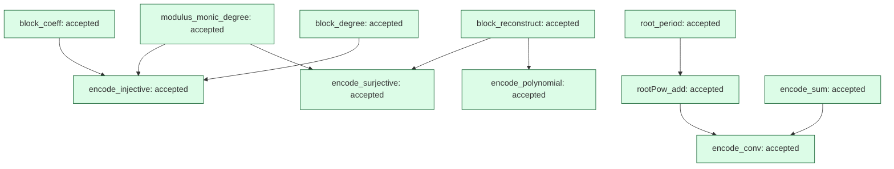

```mermaid
flowchart TD
    modulus_monic_degree["modulus_monic_degree: accepted"]:::accepted
    block_coeff["block_coeff: accepted"]:::accepted
    block_degree["block_degree: accepted"]:::accepted
    block_reconstruct["block_reconstruct: accepted"]:::accepted
    root_period["root_period: accepted"]:::accepted
    rootPow_add["rootPow_add: accepted"]:::accepted
    root_period --> rootPow_add
    encode_injective["encode_injective: accepted"]:::accepted
    modulus_monic_degree --> encode_injective
    block_coeff --> encode_injective
    block_degree --> encode_injective
    encode_surjective["encode_surjective: accepted"]:::accepted
    modulus_monic_degree --> encode_surjective
    block_reconstruct --> encode_surjective
    encode_polynomial["encode_polynomial: accepted"]:::accepted
    block_reconstruct --> encode_polynomial
    encode_sum["encode_sum: accepted"]:::accepted
    encode_conv["encode_conv: accepted"]:::accepted
    encode_sum --> encode_conv
    rootPow_add --> encode_conv
    classDef accepted fill:#dcfce7,stroke:#166534
    classDef running fill:#dbeafe,stroke:#1d4ed8
    classDef planned fill:#f3f4f6,stroke:#6b7280,stroke-dasharray:5 5
    classDef failed fill:#fee2e2,stroke:#991b1b
    classDef blocked fill:#ffedd5,stroke:#9a3412
```
