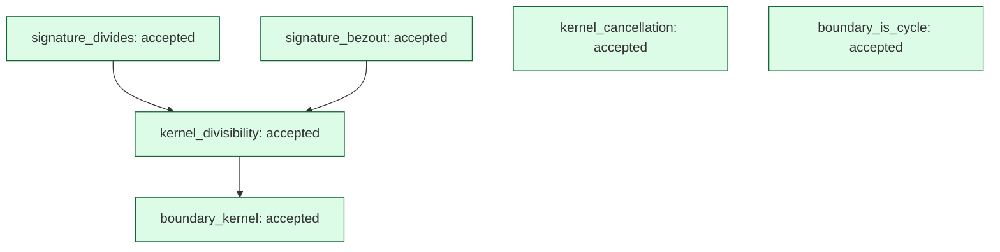

```mermaid
flowchart TD
    signature_divides["signature_divides: accepted"]:::accepted
    signature_bezout["signature_bezout: accepted"]:::accepted
    kernel_divisibility["kernel_divisibility: accepted"]:::accepted
    signature_divides --> kernel_divisibility
    signature_bezout --> kernel_divisibility
    kernel_cancellation["kernel_cancellation: accepted"]:::accepted
    boundary_is_cycle["boundary_is_cycle: accepted"]:::accepted
    boundary_kernel["boundary_kernel: accepted"]:::accepted
    kernel_divisibility --> boundary_kernel
    classDef accepted fill:#dcfce7,stroke:#166534
    classDef running fill:#dbeafe,stroke:#1d4ed8
    classDef planned fill:#f3f4f6,stroke:#6b7280,stroke-dasharray:5 5
    classDef failed fill:#fee2e2,stroke:#991b1b
    classDef blocked fill:#ffedd5,stroke:#9a3412
```
