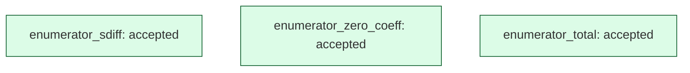

```mermaid
flowchart TD
    enumerator_sdiff["enumerator_sdiff: accepted"]:::accepted
    enumerator_zero_coeff["enumerator_zero_coeff: accepted"]:::accepted
    enumerator_total["enumerator_total: accepted"]:::accepted
    classDef accepted fill:#dcfce7,stroke:#166534
    classDef running fill:#dbeafe,stroke:#1d4ed8
    classDef planned fill:#f3f4f6,stroke:#6b7280,stroke-dasharray:5 5
    classDef failed fill:#fee2e2,stroke:#991b1b
    classDef blocked fill:#ffedd5,stroke:#9a3412
```
