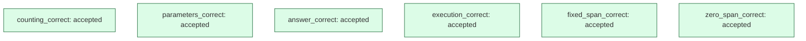

```mermaid
flowchart TD
    counting_correct["counting_correct: accepted"]:::accepted
    parameters_correct["parameters_correct: accepted"]:::accepted
    answer_correct["answer_correct: accepted"]:::accepted
    execution_correct["execution_correct: accepted"]:::accepted
    fixed_span_correct["fixed_span_correct: accepted"]:::accepted
    zero_span_correct["zero_span_correct: accepted"]:::accepted
    classDef accepted fill:#dcfce7,stroke:#166534
    classDef running fill:#dbeafe,stroke:#1d4ed8
    classDef planned fill:#f3f4f6,stroke:#6b7280,stroke-dasharray:5 5
    classDef failed fill:#fee2e2,stroke:#991b1b
    classDef blocked fill:#ffedd5,stroke:#9a3412
```
