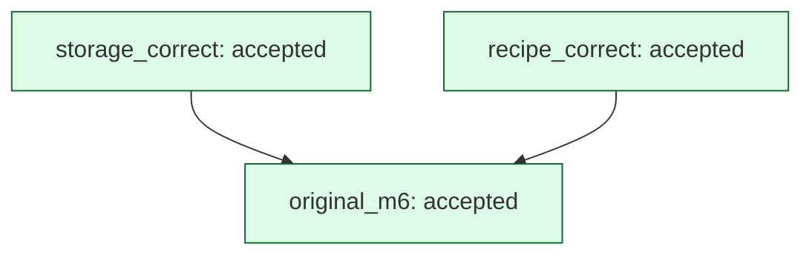

```mermaid
flowchart TD
    storage_correct["storage_correct: accepted"]:::accepted
    recipe_correct["recipe_correct: accepted"]:::accepted
    original_m6["original_m6: accepted"]:::accepted
    storage_correct --> original_m6
    recipe_correct --> original_m6
    classDef accepted fill:#dcfce7,stroke:#166534
    classDef running fill:#dbeafe,stroke:#1d4ed8
    classDef planned fill:#f3f4f6,stroke:#6b7280,stroke-dasharray:5 5
    classDef failed fill:#fee2e2,stroke:#991b1b
    classDef blocked fill:#ffedd5,stroke:#9a3412
```
