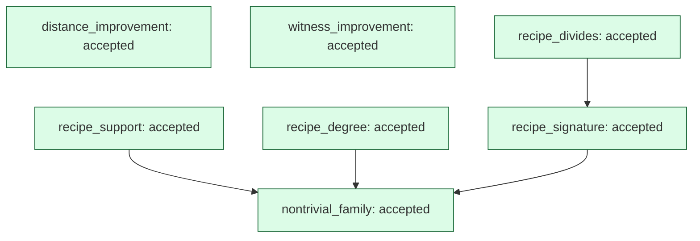

```mermaid
flowchart TD
    distance_improvement["distance_improvement: accepted"]:::accepted
    witness_improvement["witness_improvement: accepted"]:::accepted
    recipe_support["recipe_support: accepted"]:::accepted
    recipe_degree["recipe_degree: accepted"]:::accepted
    recipe_divides["recipe_divides: accepted"]:::accepted
    recipe_signature["recipe_signature: accepted"]:::accepted
    recipe_divides --> recipe_signature
    nontrivial_family["nontrivial_family: accepted"]:::accepted
    recipe_support --> nontrivial_family
    recipe_degree --> nontrivial_family
    recipe_signature --> nontrivial_family
    classDef accepted fill:#dcfce7,stroke:#166534
    classDef running fill:#dbeafe,stroke:#1d4ed8
    classDef planned fill:#f3f4f6,stroke:#6b7280,stroke-dasharray:5 5
    classDef failed fill:#fee2e2,stroke:#991b1b
    classDef blocked fill:#ffedd5,stroke:#9a3412
```
