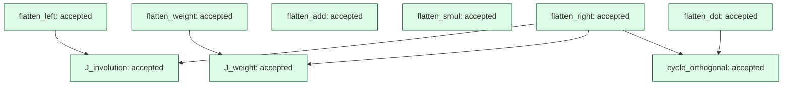

```mermaid
flowchart TD
    flatten_left["flatten_left: accepted"]:::accepted
    flatten_right["flatten_right: accepted"]:::accepted
    flatten_add["flatten_add: accepted"]:::accepted
    flatten_smul["flatten_smul: accepted"]:::accepted
    flatten_weight["flatten_weight: accepted"]:::accepted
    flatten_dot["flatten_dot: accepted"]:::accepted
    J_involution["J_involution: accepted"]:::accepted
    flatten_left --> J_involution
    flatten_right --> J_involution
    J_weight["J_weight: accepted"]:::accepted
    flatten_weight --> J_weight
    flatten_right --> J_weight
    cycle_orthogonal["cycle_orthogonal: accepted"]:::accepted
    flatten_dot --> cycle_orthogonal
    flatten_right --> cycle_orthogonal
    classDef accepted fill:#dcfce7,stroke:#166534
    classDef running fill:#dbeafe,stroke:#1d4ed8
    classDef planned fill:#f3f4f6,stroke:#6b7280,stroke-dasharray:5 5
    classDef failed fill:#fee2e2,stroke:#991b1b
    classDef blocked fill:#ffedd5,stroke:#9a3412
```
