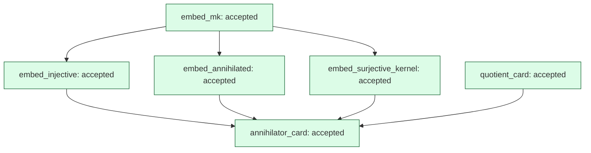

```mermaid
flowchart TD
    embed_mk["embed_mk: accepted"]:::accepted
    embed_injective["embed_injective: accepted"]:::accepted
    embed_mk --> embed_injective
    embed_annihilated["embed_annihilated: accepted"]:::accepted
    embed_mk --> embed_annihilated
    embed_surjective_kernel["embed_surjective_kernel: accepted"]:::accepted
    embed_mk --> embed_surjective_kernel
    quotient_card["quotient_card: accepted"]:::accepted
    annihilator_card["annihilator_card: accepted"]:::accepted
    embed_injective --> annihilator_card
    embed_annihilated --> annihilator_card
    embed_surjective_kernel --> annihilator_card
    quotient_card --> annihilator_card
    classDef accepted fill:#dcfce7,stroke:#166534
    classDef running fill:#dbeafe,stroke:#1d4ed8
    classDef planned fill:#f3f4f6,stroke:#6b7280,stroke-dasharray:5 5
    classDef failed fill:#fee2e2,stroke:#991b1b
    classDef blocked fill:#ffedd5,stroke:#9a3412
```
