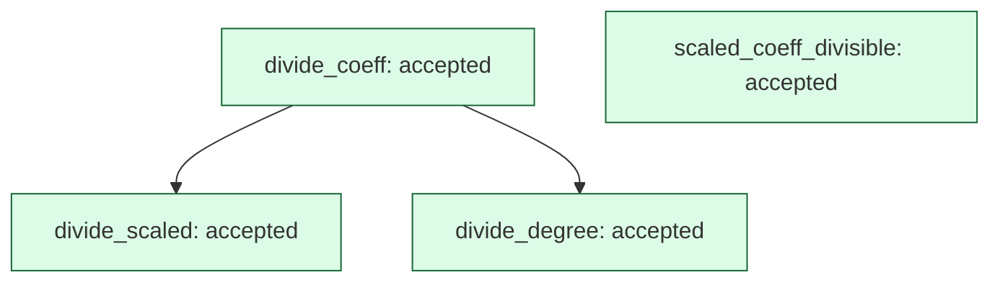

```mermaid
flowchart TD
    divide_coeff["divide_coeff: accepted"]:::accepted
    divide_scaled["divide_scaled: accepted"]:::accepted
    divide_coeff --> divide_scaled
    scaled_coeff_divisible["scaled_coeff_divisible: accepted"]:::accepted
    divide_degree["divide_degree: accepted"]:::accepted
    divide_coeff --> divide_degree
    classDef accepted fill:#dcfce7,stroke:#166534
    classDef running fill:#dbeafe,stroke:#1d4ed8
    classDef planned fill:#f3f4f6,stroke:#6b7280,stroke-dasharray:5 5
    classDef failed fill:#fee2e2,stroke:#991b1b
    classDef blocked fill:#ffedd5,stroke:#9a3412
```
