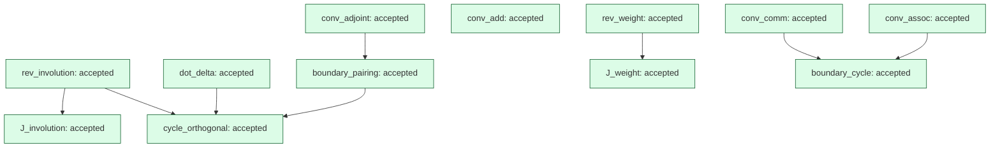

```mermaid
flowchart TD
    conv_comm["conv_comm: accepted"]:::accepted
    conv_add["conv_add: accepted"]:::accepted
    conv_assoc["conv_assoc: accepted"]:::accepted
    rev_involution["rev_involution: accepted"]:::accepted
    dot_delta["dot_delta: accepted"]:::accepted
    rev_weight["rev_weight: accepted"]:::accepted
    J_involution["J_involution: accepted"]:::accepted
    rev_involution --> J_involution
    J_weight["J_weight: accepted"]:::accepted
    rev_weight --> J_weight
    boundary_cycle["boundary_cycle: accepted"]:::accepted
    conv_comm --> boundary_cycle
    conv_assoc --> boundary_cycle
    conv_adjoint["conv_adjoint: accepted"]:::accepted
    boundary_pairing["boundary_pairing: accepted"]:::accepted
    conv_adjoint --> boundary_pairing
    cycle_orthogonal["cycle_orthogonal: accepted"]:::accepted
    boundary_pairing --> cycle_orthogonal
    rev_involution --> cycle_orthogonal
    dot_delta --> cycle_orthogonal
    classDef accepted fill:#dcfce7,stroke:#166534
    classDef running fill:#dbeafe,stroke:#1d4ed8
    classDef planned fill:#f3f4f6,stroke:#6b7280,stroke-dasharray:5 5
    classDef failed fill:#fee2e2,stroke:#991b1b
    classDef blocked fill:#ffedd5,stroke:#9a3412
```
