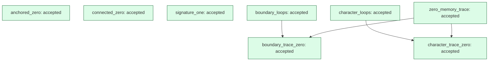

```mermaid
flowchart TD
    anchored_zero["anchored_zero: accepted"]:::accepted
    connected_zero["connected_zero: accepted"]:::accepted
    signature_one["signature_one: accepted"]:::accepted
    boundary_loops["boundary_loops: accepted"]:::accepted
    character_loops["character_loops: accepted"]:::accepted
    zero_memory_trace["zero_memory_trace: accepted"]:::accepted
    boundary_trace_zero["boundary_trace_zero: accepted"]:::accepted
    boundary_loops --> boundary_trace_zero
    zero_memory_trace --> boundary_trace_zero
    character_trace_zero["character_trace_zero: accepted"]:::accepted
    character_loops --> character_trace_zero
    zero_memory_trace --> character_trace_zero
    classDef accepted fill:#dcfce7,stroke:#166534
    classDef running fill:#dbeafe,stroke:#1d4ed8
    classDef planned fill:#f3f4f6,stroke:#6b7280,stroke-dasharray:5 5
    classDef failed fill:#fee2e2,stroke:#991b1b
    classDef blocked fill:#ffedd5,stroke:#9a3412
```
