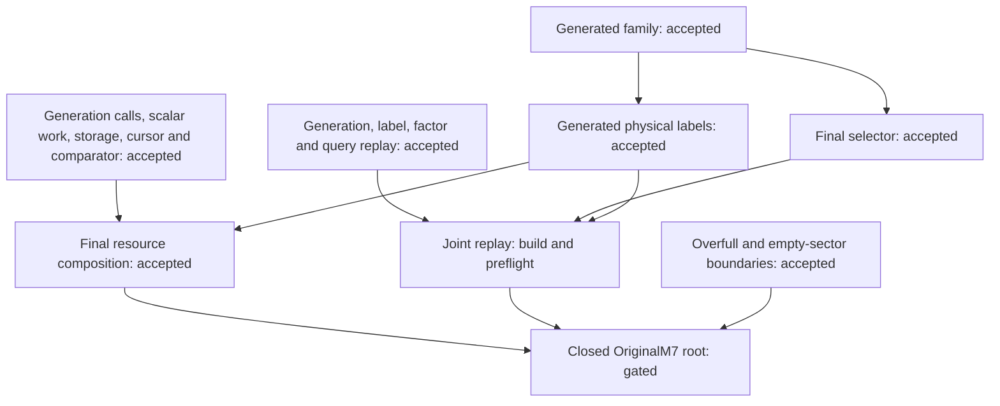

# Original M7 final integration

This is a dependency plan, not an acceptance receipt. The frozen original source is `research/quantum_m7/research_checkpoints/m7_compact_selector_final_20260915/PROOF.md`; its mathematical scope remains unchanged.

| Original clause | Concrete interface | Final connection |
| --- | --- | --- |
| Complete structural generation, exactly one record per class | `CompactGeneration.generate`, arithmetic residual, actual trace and full stabilizer | `compact_correctness` followed by `generated_family`; no supplied transversal |
| All full-signature sectors, including repeated factors | `QuerySectors.effective` and actual source signature transport | actual query selects the generated family; canonical signatures need not lie in the requested sector |
| Exact distance, NoLogical, logical witnesses, locality | sealed M6 `PointwiseCorrect`, actual solve, `QualityTable` arrays | `generated_labels` discharges actual generated-class input conditions |
| Every optimum and tie, false empty answers excluded | actual streaming index predicate over the generated family | `final_selector` equates it with raw feasible global optima |
| Unique ordered physical output | actual four-field least action preimage | `final_selector.presentation_exact`, preserving both swap records in action mode |
| Positive weight above N and empty sectors | actual support cardinality and zero residual | `overfull_boundary`; no additional weight-zero theorem required |
| Finite certificate replay | actual generation step checks, M6 arithmetic/labels and actual query checks | `generation_replay`, label/factor checks, then joint soundness/completeness; recorded hashes or counts are not premises |
| Original generation work and storage | measured generator projecting to the actual implementation; actual prefix charges and mask scans; reversible finite bit encoding | compose `generation_calls`, `scalar_work`, `compact_storage`; optional path transcripts and integer bookkeeping remain explicitly additional |
| Original comparison and label costs | measured two-cursor scan, sequential objective comparison, sealed M6 resources on every generated class | `streaming_cost`, comparison implementation, generated-class M6 instantiation; requested output remains separately charged |

The final root must import the canonical receipts and definitions together, elaborate as a closed proposition, compile, and pass the exact-target, payload, axiom and unchanged-environment checks. Component counts are not a substitute for this root.

No machine-code extraction, runtime benchmark, practical superiority, M8 efficiency, or certification of absent Python prototype features is added. Integer bit costs are distinguished from scalar-operation charges. The original conditional permission for extra verified total-computable evaluators does not introduce a free default-label oracle.

## Final dependency path

The selector and physical-label branches can run in parallel. Resource composition waits for generated physical labels; joint replay waits for both branches. The root waits for the completed compositions. Each proof batch uses two workers; the active stage set stays within the authorized sixteen-worker ceiling. A build/preflight box has no accepted proof status until the full batch receipt passes.
