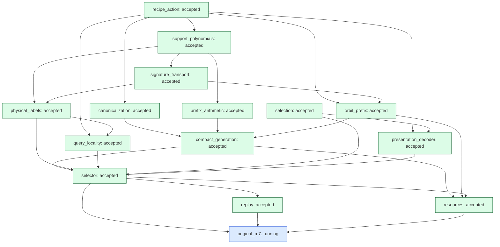

# Original M7 dependency map

The colors summarize canonical component receipts recorded in [GRAPH_STATE.json](GRAPH_STATE.json). The final root is still in build/type preflight; complete M7 acceptance is not yet established. Detailed scope and component mappings are in [graph.json](graph.json).

