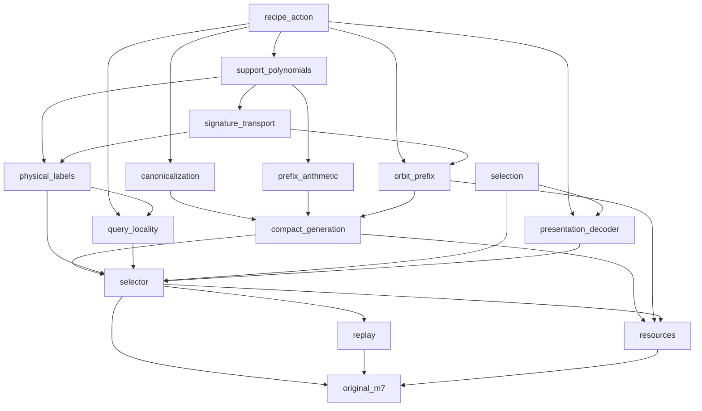

# M7 formalization dependency graph

Module gates are plans, not acceptance receipts. Ready proof nodes may use up to16 workers; edges are actual dependency gates. Individual executable graphs freeze exact Lean targets.

The finite selection and actual group foundations can proceed independently. Physical labels reuse the accepted M6 closure; arithmetic prefixes instantiate accepted M5 finite-order counting. No claim of full M7 follows from a generic finite-selector theorem. The full root must discharge every concrete bridge and original replay/no-raw-generation clause.
