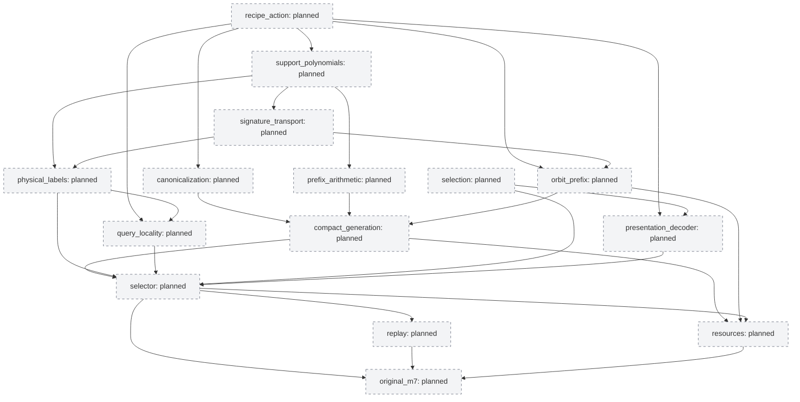

# Original M7 dependency map

Top-level nodes preserve the original proof obligations. Component receipts and running subgraphs are recorded in graph.json and CURRENT.md; no full-root acceptance is implied.

