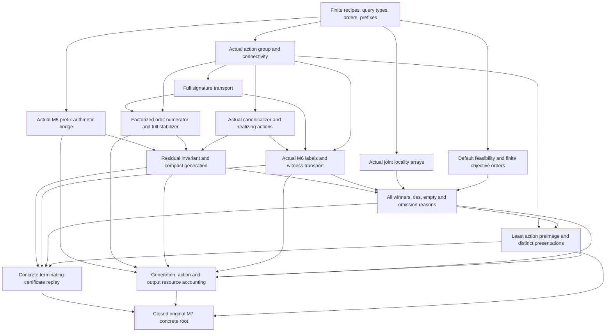

# Original M7 formalization scope and dependency review

Status: formalization planning only. No M7 Lean theorem or completed root is claimed here.

Sources read in full: `/home/jing/quantum_code_discovery_proof/research_checkpoints/m7_compact_selector_final_20260915/PROOF.md` and its `integration-decision.json`. Their SHA-256 values are respectively `8ad32a3432f4b7fd3ad15aa4467e0f01255ce593ac9e474b1af38c9424addf19` and `9ac58f77eeaba9651a62d89094ce02f7ea7d2475b594814e1f76bfd5fd44ff26`. The accepted natural-language candidate hash is `44e9358d34dd671ce76b39cd5c1f64b6a16b5229b9d98ce0e21d813b557c7a99`. Natural-language acceptance, review votes, historical harness flags, finite reports, and M5/M6 milestone names are not Lean proof premises.

The original gate is **all certified optima for requested parameters without raw scan**, at symbolic constructive-selector strength. The crucial work is the complete connection from actual arithmetic generation to actual labeled selection and replay. A generic theorem about selecting an optimum from a supplied complete list would not establish this gate.

## Exact original domain and output semantics

For finite N≥1 and 1≤w≤N, recipes are ordered pairs of w-element subsets of ZMod N. Connectedness uses all within-block differences. Only after anchoring may it be replaced by gcd(N,A,B)=1. The signature is the full monic gcd with X^N+1, including multiplicities and even N.

The action records are `(u, exchange, s, t)`, with independent translations and one common unit multiplier. The abstract exchange element remains present at N=1; the actual action need not be faithful. Do not replace the abstract group by its image in permutations when counting records or stabilizers. The precise group size is 2φ(N)N², including N=1.

The default query includes dimensions, full-signature sectors or all sectors, optional integer distance floor, optional nonnegative caps on both joint locality coordinates, an objective-coordinate list from `(L, Rloc, -k, -d)`, and Pareto/lexicographic comparison. Class-sector and placement-sector modes are distinct: the former admits an orbit meeting E even if its winning placement or canonical signature is outside E; the latter tests the realized winning placement itself. Empty objectives retain every feasible tie. NoLogical is a separate result, excluded by distance floors or distance objectives, but permitted without them when dimension zero is allowed. It is not numerical infinity.

The query-interface boundary includes rejection of invalid monic-divisor sector inputs and an empty support domain for w>N; the main theorem requires positive w. This need not introduce arbitrary-object parser correctness or a new theorem at nonpositive weights. Extensions are conditional on the original explicitly specified total computable evaluators and sound comparison/verifier contracts; these are not permission to leave default distances or default feasibility as free oracles. Presentation-mode extensions must depend on realized ordered supports; action-dependent extensions belong to action mode or an explicitly defined quotient.

## Required concrete root fields

The following is a field map, not a demand for one giant first proof. Names are suggestions; equivalent precise packaging is fine. Every generic antecedent below must be discharged for actual M7 objects at the final root.

| Root field / source | Required content and actual connection |
|---|---|
| ActualActionCorrect (§§2–3) | Concrete group law, identity/inverses and stated action; connectivity preservation; exact equivalence; group cardinality with the nonfaithful N=1 case preserved. |
| CanonicalCorrect (§3) | Actual single-block anchor minimum and unit/exchange minimum; result in the orbit; invariance and equal-canonical iff equivalent; a minimizing action and inverse. Separate block translation loops implement this canonicalizer. |
| SignatureTransportCorrect (§3) | Actual τu(F)=gcd(M,σu(F)), composition and degree preservation; translation/exchange invariance; exact literal signature of every actual action image; sector intersection witness. Work in the full quotient ideal, not root sets or a squarefree reduction. |
| PrefixArithmeticCorrect (§4) | Concrete admissible prefix and actual M5 arithmetic C_F/C_E equal connected anchored completion counts; impossible deficits yield zero; nonnegative, child partition and 0/1 leaf count. Monic factor-subset indexing equivalent to the stated H-sum is an acceptable representation; it must preserve repeated caps. No global birth theorem is required. |
| OrbitPrefixCorrect (§5) | Numerator is the sum over units/exchange of a sector indicator times the two separate shift counts; full stabilizer is its exact-target version and positive; raw identity `J=h*O` or exact divisibility plus semantic orbit-prefix count. No faithful-action or free orbit-size assumption. |
| GeneratorCorrect (§6) | Actual residual procedure starts empty, descends with T fixed, emits one new canonical orbit per positive recovered leaf, restarts, terminates, and ends with zero root residual. Prove the disjoint-orbit uncovered-subset invariant, exact coverage of every orbit meeting E, no duplicates, and exactly one descent per emitted class. Derive raw queried-orbit coverage through actual anchoring. |
| ActualLabelsCorrect (§7) | Construct polynomials from each generated canonical pair, prove actual M6 admissibility, instantiate accepted M6 trace/solve and true CSS distance/k/NoLogical conclusions; transport minimum X/Z witnesses along actual action maps. No supplied exact-label or invariant-distance assumption may remain. |
| LocalityCorrect (§8) | Actual per-block arrays compute L and maximum radius of the same realized ordered placement; action indexing maps to those exact supports. Do not substitute independently minimized L and R or prune physical ties using per-block dominance. |
| WinnersCorrect (§8) | Concrete default feasibility and exact objective semantics; Win iff feasible and globally undominated over the covered structural classes/actions; both output directions, all class/action ties, winner existence iff feasibility, and a winning strict dominator for every feasible nonwinner. Prove transitivity/irreflexivity needed for the finite improvement argument. |
| PresentationsCorrect (§9) | Actual least-action-preimage routine from separate block shift loops; exact realization; Present iff winning and least preimage; every winning ordered presentation exactly once across all classes. Preserve redundant exchange/action records in action mode. |
| ReplayCorrect (§10) | A specified terminating arithmetic verifier, construction of a replayable certificate, and soundness of acceptance for coverage/labels/witnesses/winners/omission reasons/emptiness/presentation expansion. Recompute facts; certificate numbers/hashes are not axioms. Coverage must follow from residual/disjointness checks, not matching list lengths. |
| CompactExecutionCorrect (§11) | Concrete generation representation and loop measures establish no Cartesian support-pair scan or expanded pair-orbit store; H recovered leaves, residual/numerator evaluation bounds, disclosed single-block count work and representative storage. Connect M6 indexed-array costs for labels, finite action-comparison/reconstruction loops, and explicit output costs. No polynomial-time claim at arbitrary span. |

The root should quantify over actual valid finite queries and identify outputs of the actual specified generator/selector/reconstructor and their replay certificate. It should not have `CompleteTransversal`, `ExactPrefixOracle`, `FullStabilizer`, `LabelCorrect`, `Coverage`, or `AllWinners` as unexplained input hypotheses. Semantic raw recipe sets are appropriate in theorem statements; they are not appropriate as the production generator evaluator.

## Proposed dependency DAG and parallel batches

After a shared definition freeze, four independent tracks can use the available proof-node concurrency: (1) group/canonicalization/signature, (2) M5 arithmetic-prefix specialization, (3) query/objective/locality and finite-order selector helpers, and (4) M6 specialization/physical witness infrastructure plus resource/replay primitives. M6 canonical admissibility depends on the canonicalization result, so only its independent conversion lemmas should run early. Orbit-prefix counting joins group/signature with prefix definitions. Residual generation joins arithmetic, actual orbit counts and canonical recovery. Final selection waits for actual structural coverage and actual labels; least-preimage correctness can be prepared independently of Win and specialized afterward. Replay and full root must wait for these actual connections.

Use small frozen helper targets within each track and record explicit accepted-import gates. Reuse the already accepted M5 conditional prefix counts/recovery and M6 actual root through verified source/target/payload imports. Generic finite-action fiber lemmas or generic selector lemmas are useful intermediate components, but their completion alone is not milestone completion. It is unnecessary to reprove unrelated M5 birth results or M6 physical algebra if the required exact interfaces are already accepted.

## Checks that prevent a misleading partial success

1. **Actual group multiplicity:** h is the stabilizer in the full record group. For N=1 it is 2, numerator 2, orbit count 1. Periodicity, identical blocks and action kernels must be covered without special exclusions.
2. **Anchored versus raw:** arithmetic counts anchored completions; a proven anchoring/sector argument connects this domain to every raw queried orbit. Canonical signatures are allowed outside E in class-sector mode.
3. **No circular coverage:** generation uses the residual invariant and a finite decreasing uncovered-orbit measure. A supplied exhaustive list or a proof-only orbit union used as executable storage would miss the original construction.
4. **No early quality filtering:** dimension, distance and locality tests occur after structural coverage and exact labeling. Sequential sectors retain all earlier emitted representatives.
5. **Actual M6 instance:** canonical support polynomials have equal positive weight, anchors, degree below N and the correct connectivity. The imported solver uses these actual polynomials, produces physical quantum distance and witnesses, and records NoLogical honestly. Recipe isometries must transport the actual witnesses and labels.
6. **All ties on one placement:** class output, action output and ordered-presentation output are different types. Empty objectives, identical blocks and duplicated action encodings cannot collapse requested records or retain duplicate presentations. Joint maximum locality precludes naïve blockwise dominance pruning.
7. **Replay is concrete:** arbitrary stored counts, factorization assertions, label hashes or omitted-record claims must be checked by terminating arithmetic/finite loops. A verifier defined to accept an assumed correctness proposition is not the specified replay procedure.
8. **No-raw-scan is about generation:** action-index comparison and requested output expansion are allowed and explicitly charged. The theorem does not promise H is small, compact total output, fast arbitrary-span labels, or M8 efficiency.

## Original resource and implementation boundary

The source gives `m=2(N−1)` and at most `1+H(2m+1)` residual evaluations, with at most H times that many compact orbit-count evaluations. Each numerator/stabilizer uses separate single-block shift loops, with O(φ(N)N²) mask-entry work. The conservative arithmetic prefix bound is O(N⁴ |E| τ(N) 2^(ω(M)+N)); actual integer bit costs and finite preprocessing are additional, not hidden polynomial-time guarantees. Representative/signature-table storage is O(HN+Hφ(N)N) bits plus the stated bookkeeping/transcripts. The proof-only union of emitted orbits is not stored by the algorithm.

M6 costs are summed over the H actual representatives with their actual presentation spans. Default action comparisons may examine all HP records, P=2φ(N)N², and quadratic pair comparisons; two cursors avoid a record ledger. Requested physical output can itself approach the raw domain size. Loop/event and storage representations should support these source bounds, without demanding a new machine-code extraction or unconditional Python dictionary bound.

The accepted symbolic proof explicitly discloses prototype limitations: its placements routine omits explicit swap records and retains one witness per locality value; exact_label discards the logical witness; full caps, lexicographic queries, placement-sector and certificate replay are not all implemented there. Later code/finite tests are separate evidence. Formalizing the specified mathematical procedure must not be reported as certification of those missing prototype features. Conversely, implementing every Python interface, practical superiority, code-inequivalence classification, SELF, finite catalogue labels, distance predictors, and M8 all-span efficiency are not added acceptance gates.

## Closure recommendation

Freeze the actual domain, query modes, group/action record type, output modes, and concrete arithmetic evaluator definitions before joining proof tracks. Reserve a closed `OriginalM7` proposition whose fields cover the table above. Keep pending actual bridges visible even when abstract selection helpers pass. Mark M7 formalized only after that exact root is composed from accepted concrete predecessors, compiled together, and audited under the standard Lean axioms. Until then, report completed modules and remaining joins without calling the original milestone complete.
