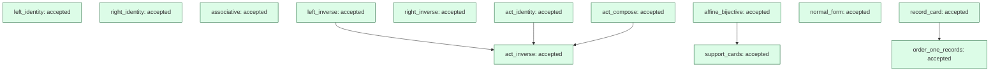

```mermaid
flowchart TD
    left_identity["left_identity: accepted"]:::accepted
    right_identity["right_identity: accepted"]:::accepted
    associative["associative: accepted"]:::accepted
    left_inverse["left_inverse: accepted"]:::accepted
    right_inverse["right_inverse: accepted"]:::accepted
    affine_bijective["affine_bijective: accepted"]:::accepted
    act_identity["act_identity: accepted"]:::accepted
    act_compose["act_compose: accepted"]:::accepted
    act_inverse["act_inverse: accepted"]:::accepted
    left_inverse --> act_inverse
    act_identity --> act_inverse
    act_compose --> act_inverse
    support_cards["support_cards: accepted"]:::accepted
    affine_bijective --> support_cards
    normal_form["normal_form: accepted"]:::accepted
    record_card["record_card: accepted"]:::accepted
    order_one_records["order_one_records: accepted"]:::accepted
    record_card --> order_one_records
    classDef accepted fill:#dcfce7,stroke:#166534
    classDef running fill:#dbeafe,stroke:#1d4ed8
    classDef planned fill:#f3f4f6,stroke:#6b7280,stroke-dasharray:5 5
    classDef failed fill:#fee2e2,stroke:#991b1b
    classDef blocked fill:#ffedd5,stroke:#9a3412
```
