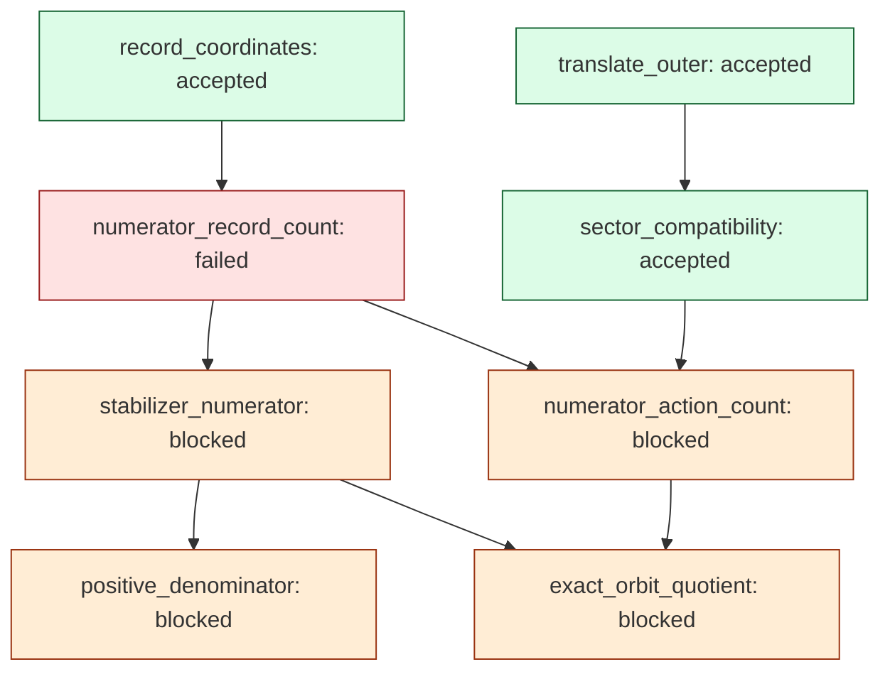

```mermaid
flowchart TD
    record_coordinates["record_coordinates: accepted"]:::accepted
    numerator_record_count["numerator_record_count: failed"]:::failed
    record_coordinates --> numerator_record_count
    stabilizer_numerator["stabilizer_numerator: blocked"]:::blocked
    numerator_record_count --> stabilizer_numerator
    translate_outer["translate_outer: accepted"]:::accepted
    sector_compatibility["sector_compatibility: accepted"]:::accepted
    translate_outer --> sector_compatibility
    numerator_action_count["numerator_action_count: blocked"]:::blocked
    numerator_record_count --> numerator_action_count
    sector_compatibility --> numerator_action_count
    positive_denominator["positive_denominator: blocked"]:::blocked
    stabilizer_numerator --> positive_denominator
    exact_orbit_quotient["exact_orbit_quotient: blocked"]:::blocked
    numerator_action_count --> exact_orbit_quotient
    stabilizer_numerator --> exact_orbit_quotient
    classDef accepted fill:#dcfce7,stroke:#166534
    classDef running fill:#dbeafe,stroke:#1d4ed8
    classDef planned fill:#f3f4f6,stroke:#6b7280,stroke-dasharray:5 5
    classDef failed fill:#fee2e2,stroke:#991b1b
    classDef blocked fill:#ffedd5,stroke:#9a3412
```
