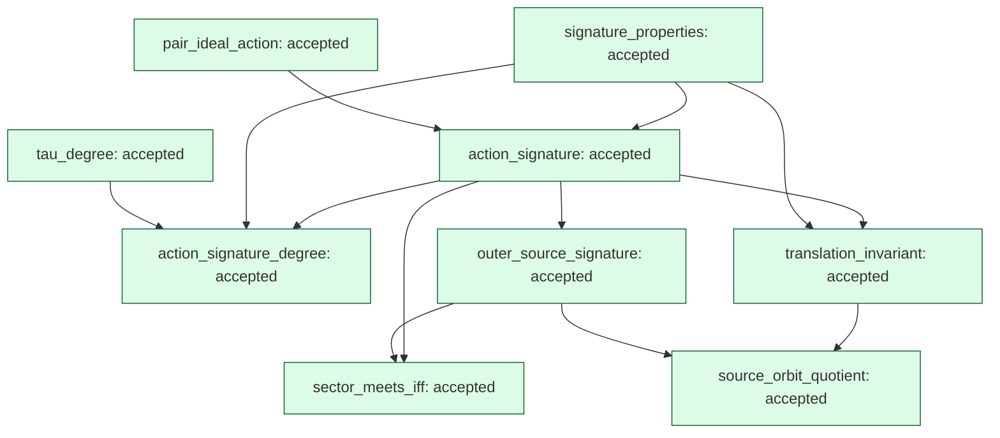

```mermaid
flowchart TD
    signature_properties["signature_properties: accepted"]:::accepted
    pair_ideal_action["pair_ideal_action: accepted"]:::accepted
    action_signature["action_signature: accepted"]:::accepted
    signature_properties --> action_signature
    pair_ideal_action --> action_signature
    tau_degree["tau_degree: accepted"]:::accepted
    action_signature_degree["action_signature_degree: accepted"]:::accepted
    action_signature --> action_signature_degree
    signature_properties --> action_signature_degree
    tau_degree --> action_signature_degree
    translation_invariant["translation_invariant: accepted"]:::accepted
    action_signature --> translation_invariant
    signature_properties --> translation_invariant
    outer_source_signature["outer_source_signature: accepted"]:::accepted
    action_signature --> outer_source_signature
    sector_meets_iff["sector_meets_iff: accepted"]:::accepted
    action_signature --> sector_meets_iff
    outer_source_signature --> sector_meets_iff
    source_orbit_quotient["source_orbit_quotient: accepted"]:::accepted
    translation_invariant --> source_orbit_quotient
    outer_source_signature --> source_orbit_quotient
    classDef accepted fill:#dcfce7,stroke:#166534
    classDef running fill:#dbeafe,stroke:#1d4ed8
    classDef planned fill:#f3f4f6,stroke:#6b7280,stroke-dasharray:5 5
    classDef failed fill:#fee2e2,stroke:#991b1b
    classDef blocked fill:#ffedd5,stroke:#9a3412
```
