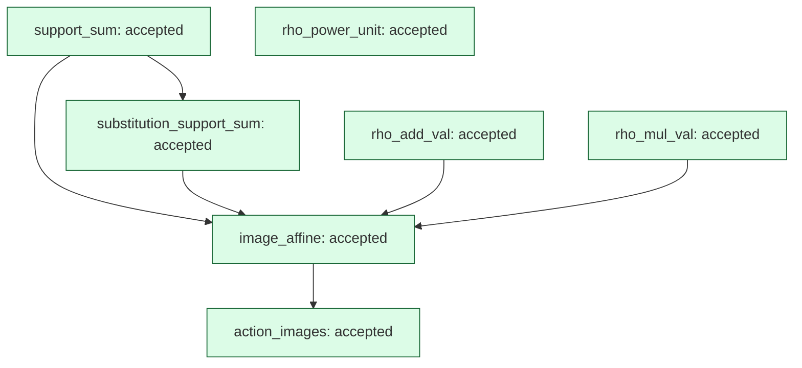

```mermaid
flowchart TD
    support_sum["support_sum: accepted"]:::accepted
    substitution_support_sum["substitution_support_sum: accepted"]:::accepted
    support_sum --> substitution_support_sum
    rho_add_val["rho_add_val: accepted"]:::accepted
    rho_mul_val["rho_mul_val: accepted"]:::accepted
    image_affine["image_affine: accepted"]:::accepted
    support_sum --> image_affine
    substitution_support_sum --> image_affine
    rho_add_val --> image_affine
    rho_mul_val --> image_affine
    rho_power_unit["rho_power_unit: accepted"]:::accepted
    action_images["action_images: accepted"]:::accepted
    image_affine --> action_images
    classDef accepted fill:#dcfce7,stroke:#166534
    classDef running fill:#dbeafe,stroke:#1d4ed8
    classDef planned fill:#f3f4f6,stroke:#6b7280,stroke-dasharray:5 5
    classDef failed fill:#fee2e2,stroke:#991b1b
    classDef blocked fill:#ffedd5,stroke:#9a3412
```
