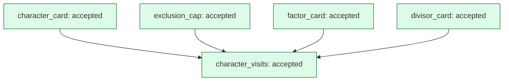

```mermaid
flowchart TD
    character_card["character_card: accepted"]:::accepted
    exclusion_cap["exclusion_cap: accepted"]:::accepted
    factor_card["factor_card: accepted"]:::accepted
    divisor_card["divisor_card: accepted"]:::accepted
    character_visits["character_visits: accepted"]:::accepted
    character_card --> character_visits
    exclusion_cap --> character_visits
    factor_card --> character_visits
    divisor_card --> character_visits
    classDef accepted fill:#dcfce7,stroke:#166534
    classDef running fill:#dbeafe,stroke:#1d4ed8
    classDef planned fill:#f3f4f6,stroke:#6b7280,stroke-dasharray:5 5
    classDef failed fill:#fee2e2,stroke:#991b1b
    classDef blocked fill:#ffedd5,stroke:#9a3412
```
